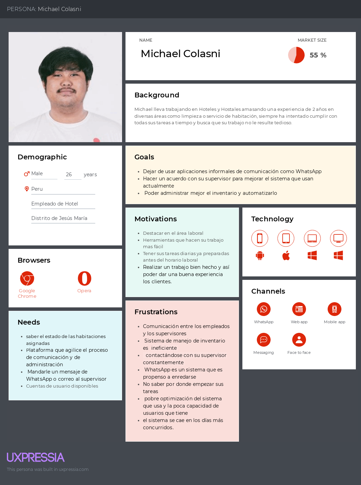
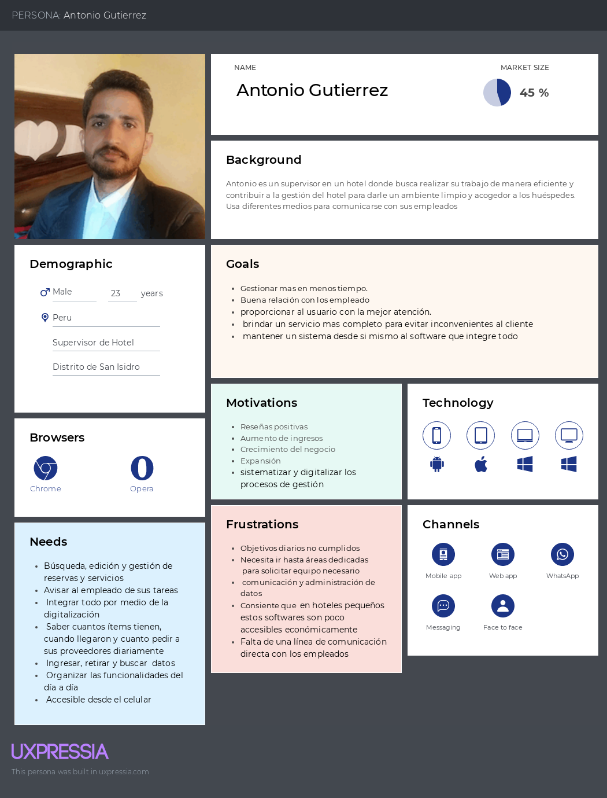
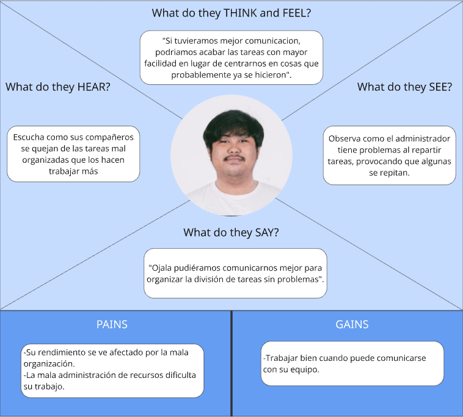
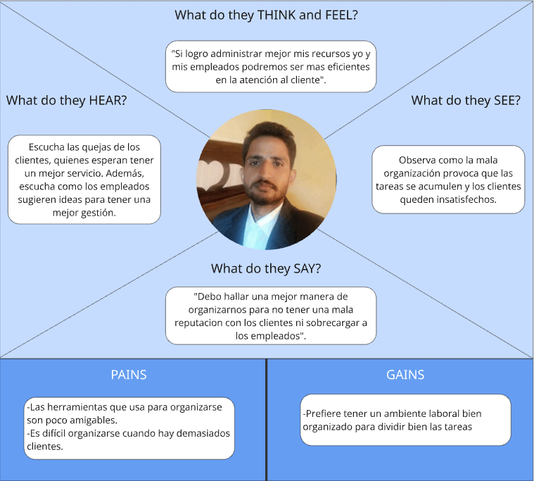

# Hotech-StarPlatinum-Report

<h1 style="text-align: center;"> Informe del Trabajo Final </h1>
<h3 style="text-align: center;"> Universidad Peruana de Ciencias Aplicadas </h3>

<tr>
  

    
    

</tr>

<h5 style="text-align: center"> Ingeniería de Software 2025-01 </h5>

<h5 style="text-align: center"> Fundamentos de Arquitectura de Software - 1ASI0657 </h5>

<h5 style="text-align: center"> NRC: 3588 </h5>

<h5 style="text-align: center"> Docente: Ernesto Campos Tello </h5>

<h5 style="text-align: center"> Startup: StarPlatinum </h5>

<h5 style="text-align: center"> Producto: Hotech </h5>

## Team members:

|               Nombre               |  Código  |
| :--------------------------------: | :--------: |
| Guia Carrasco, Pedro Andre           | U202212010       |
| More Rondon, Christopher Sebastian | U202212199 |
| Olivera Guerra, Santiago Mickelle           | U20201a821       |
| Periche Quiroga, Piero Fernando           | U202210192       |

<h5 style="text-align: center"> Abril 2025 </h5>

### Registro de Versiones del Informe

| Versión | Fecha       | Autor                              | Descripción                                            | Estado     |
| -------- | ----------- | ---------------------------------- | ------------------------------------------------------- | ---------- |
| 1.0      | 16/04/2025  | More Rondon, Christopher Sebastian | Creación del documento. | Completado |
|       |  |     |         | --         |

### Studen Outcome

| **Criterio específico**                                                                  | **Acciones realizadas** | **Conclusiones** |
| ----------------------------------------------------------------------------------------------- | ----------------------------- | ---------------------- |
| Actualiza conceptos y conocimientos necesarios para su desarrollo profesional y en especial para su proyecto en soluciones de software.| ---                           | ---                    |
| Reconoce la necesidad del aprendizaje permanente para el desempeño profesional y el desarrollo de proyectos en soluciones de software.| ---                           | ---                    |

## Capítulo I: Introducción.

### 1.1 **Startup Profile.**

#### 1.1.1   Descripción del startup

#### 1.1.2   Perfiles de integrantes del equipo

### 1.2 **Solution Profile.**

#### 1.2.1   Nombre del producto

#### 1.2.2   Antecedentes y problemática

#### 1.2.3   Lean UX Process.

#### 1.2.3.1 Lean UX Problem Statements

#### 1.2.3.2 Lean UX Assumptions.

#### 1.2.3.3 Lean UX Hypothesis.

#### 1.2.3.4 Lean UX Canvas.

### 1.3 **Segmentos Objetivos.**

## Capítulo II: Requirements & Analysis.

### 2.1 **Competidores.**

### 2.2 **Entrevistas**

### 2.3 **Needfinding.**

#### 2.3.1   User Personas.

#### 2.3.2   User Task Matrix.

#### 2.3.3   Empathy Mapping.

#### 2.3.4   As-is scenario mapping

## Capítulo III: Requirements Specification.

### 3.1 **To-Be Scenario Mapping.**

### 3.2 **User Stories.**

### 3.3 **Impact Mapping.**

### 3.4 **Product Backlog.**

# Capítulo II: Requirements & Analysis

## 2.1 **Competidores.**

**Competitive Analysis Landscape**

| ¿Por qué llevar a cabo este análisis? | Nosotros | Cloudbeds | SiteMinder |
|---------------------------------------|----------|-----------|------------|
| **Overview**                          | Nuestra startup está enfocada en desarrollar una plataforma integral para la gestión eficiente de negocios relacionados con la administración de habitaciones, con un enfoque en la industria hotelera. | Cloudbeds ofrece una solución de gestión hotelera basada en la nube que incluye herramientas para la administración de propiedades, reservas y distribución. | SiteMinder proporciona una plataforma de distribución hotelera y una suite de herramientas de gestión que incluyen gestión de tarifas, disponibilidad de habitaciones y canal de reservas en línea. |
| **Ventaja Competitiva**               | Nuestra plataforma ofrece una solución integral que abarca desde la gestión de habitaciones hasta la comunicación interna y la generación de informes de desempeño del personal. | Cloudbeds se destaca por su interfaz fácil de usar y su capacidad para integrarse con una amplia gama de sistemas y servicios de terceros. | SiteMinder se enfoca en maximizar la visibilidad en línea y la distribución de habitaciones a través de una amplia red de canales de reserva. |
| **Mercado Objetivo**                  | Nos dirigimos a hoteles independientes y pequeñas cadenas hoteleras que buscan mejorar su eficiencia operativa y experiencia del cliente. | Cloudbeds se enfoca en hoteles boutique y propiedades independientes que buscan una solución completa de gestión hotelera en la nube. | SiteMinder atiende a hoteles de todos los tamaños, desde pequeños establecimientos independientes hasta grandes cadenas hoteleras. |
| **Perfil de Marketing**               | Nuestra estrategia de marketing se centra en la promoción de nuestra plataforma a través de redes sociales y asociaciones con organizaciones de la industria hotelera. | Cloudbeds utiliza estrategias de marketing digital y participa en eventos de la industria para promover su marca y sus soluciones. | SiteMinder utiliza una combinación de marketing en línea y fuera de línea, incluidas campañas en redes sociales y publicidad en eventos de la industria. |
| **Perfil del Producto**               | Ofrecemos una variedad de herramientas y servicios, desde la gestión de habitaciones hasta la generación de informes de desempeño del personal, todo dentro de una plataforma fácil de usar y personalizable. | Cloudbeds ofrece funcionalidades como gestión de reservas, administración de canales de distribución y herramientas de informes en una interfaz intuitiva. | SiteMinder proporciona herramientas para gestionar tarifas, disponibilidad de habitaciones y reservas en línea, junto con análisis y generación de informes. |
| **Precios**  | Nuestro plataforma es de pago y contiene diferentes tipos de planes Starter, Standar y Exclusive  para satisfacer el tamaño del hotel/hostal del usuario segun la cantidad de cuentas de empleado y cuartos. |Cloud beds ofrece una tarifa dinamica segun los datos que ingrese un usuario teniendo los tipos de plan Pro y 360 |SiteMinder ofrece 3 tipos de planes los dos primeros siendo para alojamientos idependientes ofreciendo una prueba gratuita contando con el plano normal y el Plus adicionalemnte cuenta con planes para grupos hoteleros. |

**Estrategias y Tácticas frente a competidores**

 **Análisis SWOT** | Nosotros                                                                                                                                                                                                                                                                                            | Cloudbeds                                                                                                                                                                                                                                          | SiteMinder                                                                                                                                                                                                                                                                                                                                           
-------------------|-----------------------------------------------------------------------------------------------------------------------------------------------------------------------------------------------------------------------------------------------------------------------------------------------------|----------------------------------------------------------------------------------------------------------------------------------------------------------------------------------------------------------------------------------------------------|------------------------------------------------------------------------------------------------------------------------------------------------------------------------------------------------------------------------------------------------------------------------------------------------------------------------------------------------------
 **Fortalezas**    | Nuestra plataforma ofrece una solución integral y fácil de usar para la gestión de habitaciones y la comunicación interna. Además, nos destacamos por nuestra flexibilidad de precios y personalización de características.                                                                         | Cloudbeds tiene una interfaz intuitiva y se integra fácilmente con otros sistemas y servicios de terceros, lo que la convierte en una solución atractiva para hoteles independientes.                                                              | SiteMinder cuenta con una amplia red de distribución y visibilidad en línea, lo que ayuda a aumentar las reservas y la ocupación de habitaciones para los hoteles.                                                                                                                                                                                   
 **Debilidades**   | Como una startup emergente, podemos enfrentar desafíos en términos de reconocimiento de marca y alcance de mercado en comparación con competidores establecidos como Cloudbeds y SiteMinder.                                                                                                        | Cloudbeds puede tener tarifas de suscripción más altas en comparación con otras soluciones, lo que puede limitar su atractivo para hoteles con presupuestos ajustados.                                                                             | SiteMinder puede enfrentar desafíos en la retención de clientes debido a la competencia en el mercado de distribución hotelera en línea.                                                                                                                                                                                                             
 **Oportunidades** | Existe un mercado creciente de hoteles independientes y pequeñas cadenas hoteleras que buscan soluciones integrales y asequibles para mejorar su eficiencia operativa.                                                                                                                              | Cloudbeds puede expandir su alcance a través de asociaciones estratégicas con proveedores de servicios turísticos y organizaciones de la industria.                                                                                                | SiteMinder puede explorar nuevas oportunidades de crecimiento mediante la expansión a mercados emergentes y el desarrollo de características innovadoras para sus clientes.                                                                                                                                                                          
 **Amenazas**      | La competencia en el mercado de gestión hotelera puede intensificarse, lo que podría dificultar la adquisición de clientes y la retención en el futuro. Además, los cambios en las preferencias del consumidor y las regulaciones gubernamentales pueden afectar la demanda de servicios hoteleros. | Cloudbeds puede enfrentar amenazas de nuevos competidores que ingresan al mercado con soluciones similares pero más económicas. Además, los cambios en la tecnología y la regulación pueden afectar la demanda y la rentabilidad de sus servicios. | SiteMinder puede enfrentar amenazas de la consolidación en la industria hotelera y la competencia de grandes OTAs (agencias de viajes en línea) que ofrecen servicios similares de distribución de habitaciones. Además, los cambios en los algoritmos de búsqueda en línea pueden afectar la visibilidad de los hoteles que utilizan su plataforma. 

## 2.2 **Entrevistas**

**Preguntas generales:**

En esta seccion realizamos preguntas simples para tener una demografica e informacion de comportamientos que nos interesan como que browser utiliza o que dispositivos usa.

1. ¿Cuál es su nombre?
2. ¿Qué edad tiene?
3. ¿A qué se dedica?
4. ¿Que browser y dispositivos usa?

Las siguientes preguntas se realizaron para responder nuestra pregunta ya mencionada en el capitulo anterior: "Los usuarios estarán interesados en nuestra "innovadora" propuesta dado que existen otros productos similares y asimismo, realmente la necesitan?" previo a las entrevistas ya se habian preguntado el distrito de los usuarios para contactarlos.

**Entrevistas usuario segmento (Gestor de Hotel/Hostal)**

Esta seccion de preguntas se enfocan en el punto de vista de los usuarios de segmento 2 Gestor de hotel/hostal.

1. Que opiniones tiene respecto a la digitalizacion de los sitemas de gestion en hoteles o modelos de negocio parecidos?
2. ¿Como le hace saber a los empleados que tareas deben hacer?
3. ¿Como manejan el inventario de productos que utilizan tanto para limpieza como para los cuartos?
4. ¿En su opinion cree que se mantiene una comunicacion constante y efectiva entre los gerentes/supervisores y los
   empleados?
5. ¿Que frustraciones y objetivos/motivaciones tiene en su area laboral?

**Entrevistas usuario segmento (Empleado de Hotel/Hostal)**

Esta seccion de preguntas se enfocan en el punto de vista de los usuarios de segmento 1 Empleado de hotel/hostal.

1. ¿Que opiniones tiene del area laboral en el entorno de Hoteleria/Hostales?
2. ¿Como consigues la informacion de que tareas debes de realizar?
3. ¿Como notificas a tu supervisor de alguna falta de inventario?
4. ¿Mantienes una comunicacion efectiva con el gerente/supervisor en horas laborales?
5. ¿Que frustraciones y objetivos tienes en tu area laboral?

Las entrevistas estan en un video en el siguiente URL:

**Segmento 1**

**Segmento 2**

---

Nombre: Ariana Valdivia
 
Edad: 29 años
 
Ocupación: Gerencia de hoteles (3 sedes)
 
Browser: N/A
 
Device: N/A
 
Distrito: Miraflores, Surquillo, Surco.
 
Timing: 
 

<a href = "https://upcedupe-my.sharepoint.com/:v:/g/personal/u202211894_upc_edu_pe/ET8_u1p88ApJt2fvshZRbcAB2CEChNVgjXxNuPbqCmw1SA?e=xCeIhO&nav=eyJyZWZlcnJhbEluZm8iOnsicmVmZXJyYWxBcHAiOiJTdHJlYW1XZWJBcHAiLCJyZWZlcnJhbFZpZXciOiJTaGFyZURpYWxvZy1MaW5rIiwicmVmZXJyYWxBcHBQbGF0Zm9ybSI6IldlYiIsInJlZmVycmFsTW9kZSI6InZpZXcifX0%3D"> Url entrevista [Anexo 2.2.1.3]</a>  
 

Ariana cuenta que ella y su equipo cuentan con sistemas de gestion de inventario, para dar horarios y sus tareas. Respecto a la digitalizacion, menciona que los procesos empresariales se vuelven menos tediosos gracias al poder **gestionar mas en menos tiempo**. menciona que, en el sistema que tienen se asignan las tareas a sus empleados, **cada empleado sabe que hacer al dia y al finalizar el dia se revisa si se cumplieron estas tareas**. Comparte que en su analisis de inventario se organizan sabiendo **cuantos items tienen, cuando llegaron y cuanto pedir a sus proveedores diariamente**. Intentan de mantener la comunicacion por charlas y conferencias para los trabajadores de la empresa. **Necesitan** que la relacion con el trabajador sea buena para que la eficiencia de estos aumente. Menciona que las **frustraciones** que tiene se originan por un **proceso no cumplido en el dia**, intenta que los procesos esten realizados. Comenta que sus **objetivos** son proporcionar al usuario con la mejor atencion.

---

## 2.3 **Needfinding.**

### 2.3.1   User Personas.

**Segmento 1: Empleado del hotel**   
  

**Segmento 2: Manager del hotel**
  

 

### 2.3.2   User Task Matrix.

|| Segmento 1 | Empleado | Segmento 2 | Manager |
|-------------|-----------|-----------|-----------|--------|
| Titulo      | Importancia | Frecuencia | Importancia | Frecuencia |
| Recibir informacion sobre la disponibilidad de una habitacion | Alta | Media | Alta | Baja |
| Asignar tareas  | Alta | Baja | Alta | Alta |
| Avisar que se requiere algún ítem para una tarea | Alta | Alta | Baja | Media |
| Avisar de cambios en las tareas | Media | Alta | Alta | Alta |
| Registrar ítems en el inventario | Alta | Media | Alta | Alta |
| Solicitar pedidos de ítems específicos | Media | Media | Alta | Alta |
| Revisar que los empleados realizaron sus tareas | Media | Media | Alta | Alta |
| Programar las tareas del día o semana | Baja | Alta | Alta | Alta |
| Reportarse con el manager | Alta | Alta | Media | Media |

### 2.3.3   Empathy Mapping.

**Segmento 1: Empleado del hotel**   
  

**Segmento 2: Manager del hotel**
  

 

### 2.3.4   As-is scenario mapping

**Segmento 1**  

Escenario: supervisor quiere revisar el estado de los cuartos y darles sus tareas a los empleados mientras tambien debe de revisar el inventario.

As Is:

| Fases    |                      Verificar disponibilidad de habitaciones                         |                         Verificacion de inventario                         |                Asignar tareas                   |              Comunicacion con el personal                                       |
|----------|---------------------------------------------------------------------------|---------------------------------------------------------------------------|-----------------------------------------------------------|----------------------------------------------------------------------|
| Doing    | Verificando el estado actual de los cuartos                               | Revisando el inventario de elementos de limpieza y toallas                | Asignando tareas al personal de limpieza                  | Comunicándose con el personal para coordinar las tareas              |
| Thinking | Necesito saber cuantos cuartos tenemos disponibles para los clientes | Debo saber cuantos elementos de limpieza tenemos  | Mi personal esta muy sobrecargado de trabajo | Debe haber una manera de comunicarme mejor con el personal |
| Feeling  | Me preocupa no saber que cuartos estan disponibles para los clientes | Me inquieta no saber cuanto inventario nos queda | Me genera preocupacion el saber si estoy asignando las tareas correctamente | Me frustra no comunicarme bien con el personal |

**Segmento 2**  

Escenario: Empleado realiza sus actividades y desea hacerle saber al supervisor que ya termino o si este le puede dar mas tareas.

As Is:

| Fases    |                         Realizacion de tareas                               |                             Notificacion tarea completada                         |                   Verificacion de stock                       |     Comunicacion con el supervisor                                               |
|----------|------------------------------------------------------------------|-----------------------------------------------------------------------|---------------------------------------------------------------------|------------------------------------------------------------------------|
| Doing    | Realizando tareas de limpieza asignadas                          | Notificando al supervisor cuando terminan las tareas de limpieza      | Verificando el stock de elementos de limpieza y toallas             | Comunicándose con el supervisor sobre cualquier problema               |
| Thinking | Podria realizar mis tareas de manera mas eficaz | Necesito comunicarle al supervisor que termine mi tarea | Debo verificar el inventario disponible | Le dije al supervisor que podemos mejorar la forma en que realizamos las tareas |
| Feeling  | Me siento insatisfecho con la manera en que realice mis tareas | Me alegra haber terminado las tareas asignadas | Me preocupa lo mucho que nos quedamos sin equipos de limpieza o toallas | Me gustaria mejorar la comunicacion con mi supervisor |
