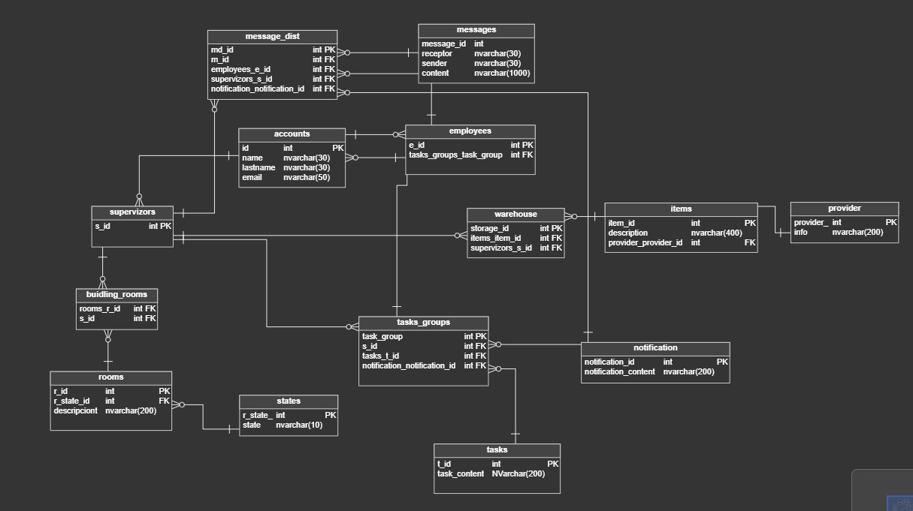
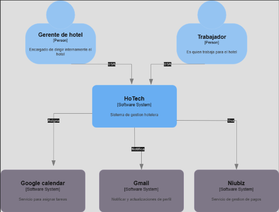
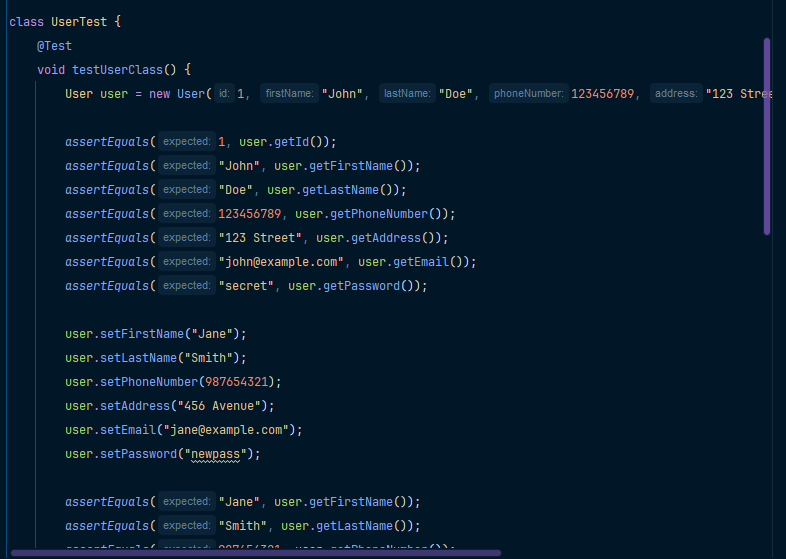

# Hotech-StarPlatinum-Report

<h1 style="text-align: center;"> Informe del Trabajo Final </h1>
<h3 style="text-align: center;"> Universidad Peruana de Ciencias Aplicadas </h3>

<tr>
  

    
    

</tr>

<h5 style="text-align: center"> Ingeniería de Software 2025-01 </h5>

<h5 style="text-align: center"> Fundamentos de Arquitectura de Software - 1ASI0657 </h5>

<h5 style="text-align: center"> NRC: 3588 </h5>

<h5 style="text-align: center"> Docente: Ernesto Campos Tello </h5>

<h5 style="text-align: center"> Startup: StarPlatinum </h5>

<h5 style="text-align: center"> Producto: Hotech </h5>

## Team members:

|               Nombre               |  Código  |
| :--------------------------------: | :--------: |
| More Rondon, Christopher Sebastian | U202212199 |
| Periche Quiroga, Piero Fernando  | U202210192       |
| Guia Carrasco, Pedro Andre | U202212010       |
|Olivera Guerra, Santiago Mickelle | U20201a821|

<h5 style="text-align: center"> Abril 2025 </h5>

### Registro de Versiones del Informe

| Versión | Fecha       | Autor                              | Descripción                                            | Estado     |
| -------- | ----------- | ---------------------------------- | ------------------------------------------------------- | ---------- |
| 1.0      | 16/04/2025  | More Rondon, Christopher Sebastian | Creación del documento. | Completado |
| 1.1      | 17/04/2025 |  Periche Quiroga, Piero Fernando   | Desarrollo del Capitulo I (APARTADO 1.1 - 1.2 - 1.3)    | Completado         |
| 1.2      | 18/04/2025 |  Guia Carrasco, Pedro Andre y More Rondon, Christopher Sebastian  | Desarrollo del Capitulo II (APARTADO 2.1 - 2.2 - 2.3)    | Completado         |
| 1.3      | 18/04/2025 | Olivera Guerra, Santiago Mickelle     | Desarrollo del Capitulo III (APARTADO 3.1 - 3.2 - 3.3 - 3.4)    | Completado         |
| 1.4      | 18/04/2025 | Olivera Guerra, Santiago Mickelle, More Rondon, Christopher Sebastian, Periche Quiroga, Piero Fernando    | Añadir los requisitos funcionales y no funcionales    | Completado         |

### Studen Outcome

| **Criterio específico**                                                                  | **Acciones realizadas** | **Conclusiones** |
| ----------------------------------------------------------------------------------------------- | ----------------------------- | ---------------------- |
| Actualiza conceptos y conocimientos necesarios para su desarrollo profesional y en especial para su proyecto en soluciones de software.| - More, Christopher (TB1): Participó en la creación del documento y en el desarrollo del Capítulo II (entrevistas, competidores y needfinding). También colaboró en los requisitos funcionales y no funcionales.  - Periche Quiroga, Piero (TB1): Desarrolló el Capítulo I, incluyendo el perfil del producto y los segmentos objetivos, aplicando conocimientos sobre modelado de startups y problemáticas reales. Aplicó herramientas modernas como Lean UX, reforzando habilidades en análisis estratégico de producto y validación de hipótesis.  - Guia Carrasco, Pedro (TB1): Participó en el desarrollo del Capítulo II, especialmente en entrevistas a usuarios clave y análisis de competidores.  - Olivera, Santiago (TB1): Desarrolló el Capítulo III (To-Be, User Stories, Impact Mapping y Product Backlog) y colaboró en requisitos. Consolidó conocimientos en metodologías ágiles y planificación iterativa de funcionalidades en productos tecnológicos.                         - More, Christopher (TP): Realicé el Software Configuration Management, permitiendome conecer más sobre las aplicaciones y páginas usadas en el desarrollo de software| El equipo demostró haber integrado eficazmente conocimientos técnicos y metodológicos actualizados, aplicándolos en las distintas fases del proyecto. Esto fortaleció su preparación profesional en el desarrollo de soluciones de software.                    |
| Reconoce la necesidad del aprendizaje permanente para el desempeño profesional y el desarrollo de proyectos en soluciones de software.| - More, Christopher (TB1): Investigó y aplicó herramientas como User Personas y Empathy Mapping.  - Periche Quiroga, Piero (TB1): Estudió y aplicó herramientas como el Lean UX Canvas y desarrolló hipótesis de usuario.  - Guia Carrasco, Pedro (TB1): Colaboró en herramientas de needfinding como Empathy Mapping y As-is scenario. Reforzó su disposición al aprendizaje activo como medio para mejorar la precisión en el desarrollo de soluciones personalizadas.  - Olivera, Santiago (TB1): e capacitó en la redacción de historias de usuario y uso de herramientas ágiles para priorización.                               - More, Christopher (TP): Aprendí más sobre los procesos del desarrollo de Software en todos sus aspecto gracias a la configuración del software a usar en el proyecto | Durante el desarrollo del proyecto, los integrantes evidenciaron una actitud proactiva hacia el aprendizaje continuo, adoptando nuevas metodologías y herramientas, lo cual es esencial para adaptarse a los cambios y demandas del sector tecnológico.                    |

## Capítulo I: Introducción.

### 1.1 **Startup Profile.**

#### 1.1.1   Descripción del startup

#### 1.1.2   Perfiles de integrantes del equipo

### 1.2 **Solution Profile.**

#### 1.2.1   Nombre del producto

#### 1.2.2   Antecedentes y problemática

#### 1.2.3   Lean UX Process.

#### 1.2.3.1 Lean UX Problem Statements

#### 1.2.3.2 Lean UX Assumptions.

#### 1.2.3.3 Lean UX Hypothesis.

#### 1.2.3.4 Lean UX Canvas.

### 1.3 **Segmentos Objetivos.**

## Capítulo II: Requirements & Analysis.

### 2.1 **Competidores.**

### 2.2 **Entrevistas**

### 2.3 **Needfinding.**

#### 2.3.1   User Personas.

#### 2.3.2   User Task Matrix.

#### 2.3.3   Empathy Mapping.

#### 2.3.4   As-is scenario mapping

## Capítulo III: Requirements Specification.

### 3.1 **To-Be Scenario Mapping.**

### 3.2 **User Stories.**

### 3.3 **Impact Mapping.**

### 3.4 **Product Backlog.**

## Capítulo IV: Product Architecture Design.

### 4.1 **Design Concepts, ViewPoints & ER Diagrams.**

#### 4.1.1 Principle Statements

#### 4.1.2 Approaches Statements Architectural Styles & Patterns 

## Capítulo IV: Product Architecture Design

### 4.1 Design Concepts, ViewPoints & ER Diagrams

#### 4.1.1 Principle Statements

#### 4.1.2 Approaches Statements Architectural Styles & Patterns

#### 4.1.3 Context Diagram

#### 4.1.4 Approach Driven ViewPoints Diagrams

#### 4.1.5 Relational/Non-Relational Database Diagrams 

#### 4.1.6 Design Patterns

#### 4.1.7 Tactics

### 4.2 **Architectural Drivers.**

#### 4.2.1 Design Purpose

#### 4.2.2 Primary Functionality (Primary User Stories)

#### 4.2.3 Quality Attribute Scenarios 

#### 4.2.4 Constraints

#### 4.2.5 Architectural Concerns 

### 4.3 **ADD Iterations.**

#### 4.3.1 Iteration 1: HoTech **MVP**

#### 4.3.1.1 Architectural Design Backlog 1

#### 4.3.1.2 Establish Iteration Goal by Selecting Drivers

#### 4.3.1.3 Choose One or More Ellements of hte System to Refine

#### 4.3.1.4 Choose One or More Design Concepts That Satisfy the Selected Drivers

#### 4.3.1.5 Instantiate Architectural Elements, Allocate Responsabilities, and Define Interfaces

#### 4.3.1.6 Sketch Views (C4 & UML) and Record Design Decisions

#### 4.3.1.7 Analysis of Current Design and Review Iteration Goal (Kanban Board)

## Capítulo V: Product Implementation, Validation & Deployment.

### 5.1 Testing Suites & General Patterns

#### 5.1.1 Backend Application Core Testing Suite

#### 5.1.2 Pattern Based Backend Application(s)

#### 5.1.3 Pattern Based Custom Software Librery

#### 5.1.4 Framework Pattern Driven Refactoring Report

### 5.2 Software Configuration Management

#### 5.2.1 Software Development Environment Configuration

#### 5.2.2 Source Code Management

#### 5.2.3 Source Code Style Guide & Conventions

#### 5.2.4 Software Deployment Configuration

### 5.3 Microservices Implementation

#### 5.3.1 Sprint 1

#### 5.3.1.1 Sprint Backlog 1

#### 5.3.1.2 Development Evidence for Sprint Review

#### 5.3.1.3 Testing Suite Evidence for Sprint Review

#### 5.3.1.4 Execution Evidence for Sprint Review

#### 5.3.1.5 Microservices Documentation Evidence for Sprint Review

#### 5.3.1.6 Software Deployment Evidence for Sprint Review

#### 5.3.1.7 Team Collaboration Insights During Sprint

#### 5.3.1.8 Kanban Board

# Capítulo I: Introducción

## 1.1. Startup Profile

### 1.1.1. Descripción de la Startup

Nuestra startup "HoTech" es un servicio de gestion orientado a negocios en el rubro de hospedajes u hotelería el
cual provee un seguimiento de inventario, empleados, espacios, tiempos y servicios utilizados en el proceso del
servicio. Asimismo mantendrá igualmente un contacto tanto con los empleados como sus gerentes.
gerentes.

#### 1.1.2. Perfiles de integrantes del equipo

| Miembros del equipo                                                                                                   | Codigo Estudiante | Carrera                | Conocimientos / Habilidades                                                              |
|-----------------------------------------------------------------------------------------------------------------------|-------------------|------------------------|------------------------------------------------------------------------------------------|
| More Rondon, Christopher Sebastian                      | U202212199        | Ingeniería de software | Phyton, C++, C#, MongoDB, HTML, CSS, JS. Responsable y creativo.      |
|  Guia Carrasco, Pedro André                       | U202212010        | Ingeniería de software | Java, Python, HTML, CSS, Javascript, SQL, MongoDB, Angular. Responsable y trabajo en equipo               | 
| Olivera Guerra, Santiago Mickelle    | U20201a821         | Ingeniería de software | Springboot , Android , SQL y Angular, detallista y trabajo en equipo|
| Periche Quiroga, Piero         | U202210192        | Ingeniería de software | C++, SQL, Java, C#, Js. Responsabilidad y buen ambiente de equipo                |

## 1.2. Solution Profile

### 1.2.1 Antecedentes y problemática

En el Perú, se ha identificado una carencia significativa de inversión en el sector turístico, como lo señala María Alejandra Gonzales (2023). Esta situación también ha sido resaltada por Blanca Chávez, vocera de la Asociación de Hoteles, Restaurantes y Afines, quien expresa su preocupación por la falta de incentivos económicos, consecuencia de las crisis recientes que ha atravesado el país. Frente a este panorama, resulta crucial que los hoteles y hostales evidencien su capacidad de adaptación y gestión eficiente, enfocándose en mejorar la calidad de sus servicios mientras optimizan sus costos operativos.

Actualmente, la industria hotelera está en un proceso de transformación, apostando por la digitalización para agilizar y simplificar sus procesos administrativos. De acuerdo con Eva Lacalle (2023), la tecnología permite ofrecer una atención más fluida, otorga mayor autonomía a los huéspedes, automatiza tareas repetitivas y mejora la experiencia general tanto para los clientes como para el personal. Además, destaca que incorporar herramientas tecnológicas incrementa la competitividad, favoreciendo una mejora continua en el sector.

Durante 2024, el equipo de BIMnD ha compartido cómo la digitalización contribuye a la sostenibilidad de los hoteles, permitiendo la implementación de tecnologías innovadoras como los recorridos virtuales o la gestión en entornos 3D. Estas soluciones ya se aplican en ciertos establecimientos europeos, generando mejoras significativas en la eficiencia operativa.

### 5W + 2H del proyecto **HoTech**

| Pregunta                                     | Descripción                                                                                                                                                                                                                                                                                         |
|---------------------------------------------|-----------------------------------------------------------------------------------------------------------------------------------------------------------------------------------------------------------------------------------------------------------------------------------------------------|
| **¿What? - ¿Cuál es el problema?**           | El proyecto **HoTech** nace como respuesta a los problemas de desorganización dentro del rubro hotelero, donde una gestión deficiente repercute directamente en la coordinación interna y, por consiguiente, en la experiencia del huésped. Esta situación genera ineficiencia y afecta la calidad del servicio brindado. |
| **¿Who? - ¿Quiénes son los beneficiarios?**  | **HoTech** está dirigido a negocios del sector hotelero y de hospedaje, ofreciendo una plataforma integral para el control de inventario, gestión de personal, supervisión de espacios, tiempos y servicios. Además, facilita la comunicación entre el establecimiento, sus empleados, gerentes y proveedores. |
| **¿Where? - ¿Dónde se origina el problema?** | La dificultad de una buena gestión en los procesos operativos es un problema global en hoteles, afectando su eficiencia. **HoTech** propone una solución adaptable a cualquier ubicación donde se presten servicios de hospedaje, optimizando la coordinación y el funcionamiento interno.                     |
| **¿When? - ¿Cuándo se origina el problema?** | La necesidad de contar con herramientas digitales surge en el contexto actual, donde se hace evidente la urgencia de modernizar la administración de hospedajes. **HoTech** se presenta como una solución clave para mejorar la atención y organización en los establecimientos.                              |
| **¿Why? - ¿Por qué se origina el problema?** | El origen del problema radica en la desconexión operativa, el uso de métodos manuales y la falta de integración tecnológica. **HoTech** enfrenta esta situación brindando soluciones prácticas y digitales que mejoran los procesos internos y elevan la calidad de atención.                                |
| **¿How? - ¿Cómo se lleva a cabo la solución?** | A través de la implementación de tecnología web, **HoTech** digitaliza la gestión operativa permitiendo el control visual y automatizado de tareas como inventario, horarios, limpieza y servicios. También facilita la interacción entre los distintos actores del negocio.                                |
| **¿How much? - ¿Cuánto cuesta?**             | El servicio contará con una tarifa inicial y una suscripción mensual variable según el número de habitaciones que se deban gestionar. Esto permitirá escalar el servicio de manera flexible, brindando accesibilidad a pequeños emprendimientos mediante paquetes diferenciados según el tipo de establecimiento. |

5 w's 2 h

Concientiza de la importancia de las ONG.

¿Por qué se está haciendo?
La creación de esta aplicación web responde a la necesidad de brindar a hoteles y hospedajes una herramienta accesible, intuitiva y eficiente para automatizar procesos como el control de inventario, la gestión de tiempos de habitación, turnos de limpieza y otros procedimientos que, tradicionalmente, se realizan de forma manual. Con HoTech, todo esto se vuelve más dinámico y adaptable a cada negocio.

¿Cuándo se utiliza?
El uso de HoTech es ideal cuando el negocio atraviesa temporadas de alta demanda, requiere realizar múltiples gestiones al mismo tiempo o simplemente busca optimizar su administración diaria para mejorar la atención al cliente.

¿Dónde se utiliza?
Inicialmente, la plataforma se orienta al mercado peruano, con el objetivo de acompañar el crecimiento de nuevos emprendimientos en hotelería y hospedaje, así como monitorear el funcionamiento local del sistema para futuras mejoras.

¿Quién lo usa?
Los principales usuarios serán los gerentes, supervisores o administradores del establecimiento. Aunque se puede automatizar la notificación de tareas para el personal, el enfoque está en que los encargados tengan una vista completa de los procesos y puedan intervenir manualmente si es necesario.

¿Cuánto costará?
El modelo de precios incluye una tarifa inicial por activación del sistema y un pago mensual que varía según la cantidad de habitaciones a gestionar. De esta forma, se asegura una relación directa entre el tamaño del establecimiento y el costo del servicio, promoviendo la inclusión de negocios pequeños mediante paquetes personalizados (por ejemplo: hostal, hotel pequeño, hotel grande).

¿Cómo se lleva a cabo?
La plataforma web contará con un espacio de trabajo visual donde el administrador podrá monitorear procesos en tiempo real: entregas programadas de inventario, turnos de limpieza, habitaciones ocupadas o libres, solicitudes de servicios adicionales, entre otros. El sistema permitirá registrar habitaciones de forma semi-automática, asignándoles números, servicios y estados. También se podrán configurar horarios específicos para tareas como mantenimiento, lavandería o reposición de insumos, todo ajustado a las necesidades del negocio.

## 1.2.2 Lean UX Process
1.2.2.1. Declaración del Problema (Lean UX Problem Statement)
Actualmente, muchos negocios del sector hotelero y de hospedaje enfrentan serias dificultades en la organización de sus procesos internos. La carencia de una gestión eficiente del inventario, del personal, de los espacios y de los servicios impacta negativamente en la calidad del servicio al cliente y en la operatividad del negocio. Esta desorganización puede ocasionar errores en la distribución de recursos, demoras en la atención y una experiencia deficiente para los huéspedes.

Una gran debilidad de otros sistemas es su lentitud para adaptarse a los cambios tecnológicos, lo que provoca que sus plataformas se vuelvan obsoletas o poco amigables para el usuario. A esto se suma la presión que enfrentan los gerentes por mantener estándares altos de calidad y eficiencia, en un entorno donde muchas tareas siguen realizándose manualmente y con herramientas inadecuadas. Todo esto se traduce en pérdidas de tiempo, recursos y, finalmente, rentabilidad.

HoTech surge como una propuesta que prioriza la experiencia del usuario, ofreciendo funcionalidades intuitivas, un sistema de gestión visual completo, canales de comunicación interna entre gerentes y empleados, y opciones accesibles pensadas para pequeños negocios en proceso de digitalización.

Nuestro enfoque está dirigido principalmente a los gerentes de hoteles, quienes podrán evaluar directamente los beneficios del sistema junto con sus equipos de trabajo.

Por lo tanto, el reto que buscamos resolver es:
¿Cómo podemos brindar a los gerentes de establecimientos hoteleros una plataforma accesible y eficaz que les permita coordinar adecuadamente la gestión de inventario, personal, espacios y servicios, mejorando así tanto la experiencia del cliente como la eficiencia operativa en al menos un 45%?

La solución planteada consiste en un servicio de gestión digital capaz de optimizar y automatizar tareas clave dentro de la operación de hoteles y hostales.

El éxito de nuestro producto será medido mediante encuestas de control, donde esperamos alcanzar al menos un 45% de satisfacción por parte de gerentes y empleados, así como contribuir con un incremento del 5% en la productividad del sector turístico.

### 1.2.2.2. Supuestos Lean UX (Lean UX Assumptions)
Resultados del Negocio
Aplicaremos el enfoque de la “Montaña de Métricas” de Jeff Gothelf junto con las métricas pirate (AARRR) para analizar el comportamiento de nuestros usuarios a lo largo del journey y generar hipótesis relevantes sobre su interacción con el producto.

Adquisición (Base): [1000 visitantes]
Los usuarios conocerán HoTech a través de campañas en redes sociales y nuestra landing page. También se aplicarán estrategias de contacto directo con instituciones hoteleras.

Activación (Primer Plateau): [450 usuarios]
Se espera que el 45% de quienes descubran el producto se registren como usuarios. El proceso de activación incluye crear una cuenta con datos del negocio (habitaciones, pisos, métodos de pago, emails institucionales) y generar códigos para que los empleados accedan a la plataforma.

Retención (Plateau + 1 nivel): [60% de los usuarios activos]
De los usuarios activos, esperamos que al menos un 60% utilice la plataforma diariamente para gestionar tareas y mantener la comunicación interna con sus equipos.

Ingresos (Plateau + 2 niveles): [10% de usuarios]
Aunque todos los usuarios son de pago, se prevé que un 10% de los clientes crezcan con el tiempo (más habitaciones, más personal) y, en consecuencia, migren a planes superiores que generen mayores ingresos.

Recomendación (Top): [5% de usuarios]
Proyectamos que un 5% de los usuarios referirá nuestro servicio a otros colegas o emprendedores del sector, lo que permitirá aumentar el flujo de nuevos clientes potenciales.

## Users

En esta sección presentamos un Proto-Persona, como una suposición inicial sobre nuestros usuarios, enfocándonos principalmente en su actitud y comportamiento.

| Demográfica | Comportamiento | Necesidades / Obstáculos |
|-------------|----------------|---------------------------|
| **Alex:** 35 años   Gestor de hotel/hostal | - Trabaja en un hotel/hostal   - Gana lo suficiente   - Enfocado en la gestión de tareas   - Busca que todo esté en orden | - Necesita ampliar el área de gestión   - Necesita mejorar la asignación de tareas   - Requiere una mejor comunicación con los empleados a quienes asigna tareas   - Obstáculo: El hotel utiliza herramientas obsoletas o no cuenta con una solución para asignar tareas   - Obstáculo: Usan medios informales como WhatsApp, lo que dificulta una comunicación eficiente   - Busca mejorar la organización del hotel/hostal |
| **Carla:** 27 años   Empleada de limpieza | - Gana lo mínimo   - Enfocada en cumplir con sus tareas   - Busca terminar su trabajo rápidamente | - Necesita un canal directo de comunicación con su gestor   - Requiere una forma de notificar la falta de insumos   - Necesita notificar qué habitaciones están listas y saber cuáles preparar   - Obstáculo: Todos se comunican en el mismo grupo de WhatsApp y se pierden tareas   - Obstáculo: No existe un registro seguro de las tareas asignadas   - Busca comunicar de inmediato el estado de una habitación   - Busca alertar si falta algo necesario para la preparación |

Esta tabla representa nuestras principales suposiciones sobre los usuarios, incluyendo sus comportamientos, necesidades y obstáculos en su entorno laboral.

---

## User Outcomes & Benefits

En esta sección abordamos el lado más emocional del usuario para empatizar con sus objetivos y entregarles el resultado adecuado.

**¿Qué busca lograr el usuario?**  
Quiero notificar a mi supervisor que necesito ciertos materiales para realizar mis tareas.  
**¿Cómo se quiere sentir el usuario en este proceso?**  
Quiero sentirme como si tuviera una línea directa con el supervisor.  
**¿Cómo nuestro producto lo acerca a un logro personal?**  
Quiero sentirme escuchado y tomado en cuenta.  
**¿Por qué buscaría nuestro producto?**  
Quiero que mis tareas se puedan realizar sin problemas.  
**¿Qué cambio de comportamiento nos indicará que lograron su objetivo?**  
Sabremos que tuvimos éxito cuando el usuario presente una comunicación efectiva con su supervisor utilizando nuestro producto.

---

**¿Qué busca lograr el usuario?**  
Quiero revisar los estados de cuarto.  
**¿Cómo se quiere sentir el usuario en este proceso?**  
Quiero sentir que con solo mirar ya puedo saber el estado de una habitación.  
**¿Cómo nuestro producto lo acerca a un logro personal?**  
Quiero sentir que puedo manejarme y organizarme.  
**¿Por qué buscaría nuestro producto?**  
Quiero realizar mis tareas de forma tan sencilla como mirar por la ventana.  
**¿Qué cambio de comportamiento nos indicará que lograron su objetivo?**  
Sabremos que tuvimos éxito cuando el usuario presente un monitoreo rápido de habitaciones utilizando nuestro producto.

---

**¿Qué busca lograr el usuario?**  
Quiero mantenerme comunicado con mi (gerente/empleado) para poder (entregar/recibir) tareas.  
**¿Cómo se quiere sentir el usuario en este proceso?**  
Quiero sentir que puedo ver todos los aspectos logísticos del hotel en un solo lugar.  
**¿Cómo nuestro producto lo acerca a un logro personal?**  
Quiero sentir que tengo el control de mis acciones.  
**¿Por qué buscaría nuestro producto?**  
Quiero hacer más trabajo en menos tiempo y con menor esfuerzo.  
**¿Qué cambio de comportamiento nos indicará que lograron su objetivo?**  
Sabremos que tuvimos éxito cuando el usuario se comunique y realice sus tareas de forma efectiva utilizando nuestro producto.

Este análisis de User Outcomes aplica para ambos segmentos, ya que comparten objetivos similares, permitiéndonos comprender el contexto desde diferentes perspectivas.

---

## Solutions

Aunque Jeff Gothelf menciona en su libro *Lean UX 3rd Edition* que idealmente se deben utilizar elementos físicos como post-its, en nuestro caso realizamos una llamada para definir las soluciones propuestas.

Considerando las restricciones anteriores, nuestras soluciones asumidas son:

- **Monitoreo de estados de cuartos:** Permite notificar el estado de una habitación sin necesidad de herramientas como WhatsApp. Considerar validaciones necesarias.
- **Entrega de tareas:** Posibilita asignar tareas de forma remota, sin necesidad de comunicación verbal, con seguimiento incluido. Solo el usuario asignado podrá finalizar la tarea.
- **Revisión de inventario:** Facilita el seguimiento de artículos en la bodega, registrando entradas y salidas. Incluye la opción de agregar proveedores.
- **Comunicación empleado/gerente:** Sistema de comunicación directa para emergencias o dudas, sin distracciones, y con registro de los mensajes enviados.

---

### 1.2.2.3 Lean UX Hypothesis Statements

**Hipótesis**

Siguiendo el formato propuesto, cada hipótesis comienza con "Creemos que...".

| Business Outcome | Persona | User Outcome | Feature/Solution |
|------------------|---------|--------------|------------------|
| Conseguiremos una retención del 20% de usuarios | Si los gerentes de hoteles/hostales | entregan tareas a sus empleados | con el sistema de comunicación para emergencias o dudas |
| Conseguiremos una retención del 20% de usuarios óptima | Si los gerentes de hoteles/hostales | logran monitorear los estados de cuarto | con el sistema de monitoreo de cuartos |
| Conseguiremos una retención del 60% de usuarios óptima | Si los gerentes de hoteles/hostales | se sienten en control de sus actividades | con herramientas de gestión como monitoreo de cuartos, entrega de tareas, inventario y comunicación |
| Conseguiremos una retención del 20% de usuarios óptima | Si los empleados notifican al gerente los insumos necesarios | con el sistema de comunicación entre empleado y gerente |
| Conseguiremos que el 10% de usuarios nos genere una ganancia | Si los gerentes de hoteles/hostales | mejoran su plan de cuenta | mediante la opción de actualización del servicio |
| Conseguiremos que el 5% de usuarios nos referencien | Si gerentes y empleados | logran una comunicación efectiva | con el sistema de comunicación empleado/gerente |
| Conseguiremos que el 45% de adquisición de usuarios provenga de la web | Si gerentes y empleados | consideran nuestra solución como una mejora | gracias a la landing page implementada |

---

### ¿Qué es lo más importante que debemos aprender?

Debemos evaluar si los usuarios realmente estarán interesados en nuestra propuesta, considerando que existen productos similares. ¿Nuestra solución resulta realmente necesaria para ellos?

---

## Minimum Viable Product (MVP)

Los MVP nos permiten validar aprendizajes en el corto plazo. Para ello respondemos:

**¿Qué es lo más importante que necesitamos aprender primero?**

Debemos confirmar si existe una necesidad real en el mercado. Por eso, realizaremos entrevistas a gerentes de hotel/hostal y sus empleados, y además lanzaremos una landing page como MVP para captar a los interesados.

---

### 1.2.2.4 Lean UX Canvas

Finalmente, integramos todo lo trabajado en un Lean UX Canvas (V2), siguiendo el modelo de Jeff Gothelf.

## 1.3 Segmentos Objetivo

|                          | Segmento 1                                                                                                                                    | Segmento 2                                                                                                                                                                                                  |
|--------------------------|------------------------------------------------------------------------------------------------------------------------------------------------|-------------------------------------------------------------------------------------------------------------------------------------------------------------------------------------------------------------|
| Variables                | Empleado del negocio                                                                                                                           | Gestor del negocio                                                                                                                                                                                          |
| Geográfica               | Ubicación cercana al establecimiento hotelero u hospedaje                                                                                     | Preferiblemente ubicado en la misma región del negocio                                                                                                                                                      |
| Demográfica              | Diversidad en edad y género                                                                                                                    | Edad adulta, posiblemente con formación universitaria en administración o gestión                                                                                                                           |
| Psicológica              | Actitud favorable hacia nuevas tecnologías, motivación por mejorar la eficiencia laboral                                                      | Orientado a la eficiencia y mejora continua, con interés en soluciones tecnológicas                                                                                                                         |
| Comportamiento           | Necesita herramientas que le ayuden con tareas diarias y optimicen procesos para mejorar el servicio                                           | Requiere herramientas que permitan supervisar y gestionar eficientemente todas las áreas, priorizando la experiencia del cliente y la optimización de los recursos                                           |

# Capítulo II: Requirements & Analysis

## 2.1 **Competidores.**

**Competitive Analysis Landscape**

| ¿Por qué llevar a cabo este análisis? | Nosotros | Cloudbeds | SiteMinder |
|---------------------------------------|----------|-----------|------------|
| **Overview**                          | Nuestra startup está enfocada en desarrollar una plataforma integral para la gestión eficiente de negocios relacionados con la administración de habitaciones, con un enfoque en la industria hotelera. | Cloudbeds ofrece una solución de gestión hotelera basada en la nube que incluye herramientas para la administración de propiedades, reservas y distribución. | SiteMinder proporciona una plataforma de distribución hotelera y una suite de herramientas de gestión que incluyen gestión de tarifas, disponibilidad de habitaciones y canal de reservas en línea. |
| **Ventaja Competitiva**               | Nuestra plataforma ofrece una solución integral que abarca desde la gestión de habitaciones hasta la comunicación interna y la generación de informes de desempeño del personal. | Cloudbeds se destaca por su interfaz fácil de usar y su capacidad para integrarse con una amplia gama de sistemas y servicios de terceros. | SiteMinder se enfoca en maximizar la visibilidad en línea y la distribución de habitaciones a través de una amplia red de canales de reserva. |
| **Mercado Objetivo**                  | Nos dirigimos a hoteles independientes y pequeñas cadenas hoteleras que buscan mejorar su eficiencia operativa y experiencia del cliente. | Cloudbeds se enfoca en hoteles boutique y propiedades independientes que buscan una solución completa de gestión hotelera en la nube. | SiteMinder atiende a hoteles de todos los tamaños, desde pequeños establecimientos independientes hasta grandes cadenas hoteleras. |
| **Perfil de Marketing**               | Nuestra estrategia de marketing se centra en la promoción de nuestra plataforma a través de redes sociales y asociaciones con organizaciones de la industria hotelera. | Cloudbeds utiliza estrategias de marketing digital y participa en eventos de la industria para promover su marca y sus soluciones. | SiteMinder utiliza una combinación de marketing en línea y fuera de línea, incluidas campañas en redes sociales y publicidad en eventos de la industria. |
| **Perfil del Producto**               | Ofrecemos una variedad de herramientas y servicios, desde la gestión de habitaciones hasta la generación de informes de desempeño del personal, todo dentro de una plataforma fácil de usar y personalizable. | Cloudbeds ofrece funcionalidades como gestión de reservas, administración de canales de distribución y herramientas de informes en una interfaz intuitiva. | SiteMinder proporciona herramientas para gestionar tarifas, disponibilidad de habitaciones y reservas en línea, junto con análisis y generación de informes. |
| **Precios**  | Nuestro plataforma es de pago y contiene diferentes tipos de planes Starter, Standar y Exclusive  para satisfacer el tamaño del hotel/hostal del usuario segun la cantidad de cuentas de empleado y cuartos. |Cloud beds ofrece una tarifa dinamica segun los datos que ingrese un usuario teniendo los tipos de plan Pro y 360 |SiteMinder ofrece 3 tipos de planes los dos primeros siendo para alojamientos idependientes ofreciendo una prueba gratuita contando con el plano normal y el Plus adicionalemnte cuenta con planes para grupos hoteleros. |

**Estrategias y Tácticas frente a competidores**

 **Análisis SWOT** | Nosotros                                                                                                                                                                                                                                                                                            | Cloudbeds                                                                                                                                                                                                                                          | SiteMinder                                                                                                                                                                                                                                                                                                                                           
-------------------|-----------------------------------------------------------------------------------------------------------------------------------------------------------------------------------------------------------------------------------------------------------------------------------------------------|----------------------------------------------------------------------------------------------------------------------------------------------------------------------------------------------------------------------------------------------------|------------------------------------------------------------------------------------------------------------------------------------------------------------------------------------------------------------------------------------------------------------------------------------------------------------------------------------------------------
 **Fortalezas**    | Nuestra plataforma ofrece una solución integral y fácil de usar para la gestión de habitaciones y la comunicación interna. Además, nos destacamos por nuestra flexibilidad de precios y personalización de características.                                                                         | Cloudbeds tiene una interfaz intuitiva y se integra fácilmente con otros sistemas y servicios de terceros, lo que la convierte en una solución atractiva para hoteles independientes.                                                              | SiteMinder cuenta con una amplia red de distribución y visibilidad en línea, lo que ayuda a aumentar las reservas y la ocupación de habitaciones para los hoteles.                                                                                                                                                                                   
 **Debilidades**   | Como una startup emergente, podemos enfrentar desafíos en términos de reconocimiento de marca y alcance de mercado en comparación con competidores establecidos como Cloudbeds y SiteMinder.                                                                                                        | Cloudbeds puede tener tarifas de suscripción más altas en comparación con otras soluciones, lo que puede limitar su atractivo para hoteles con presupuestos ajustados.                                                                             | SiteMinder puede enfrentar desafíos en la retención de clientes debido a la competencia en el mercado de distribución hotelera en línea.                                                                                                                                                                                                             
 **Oportunidades** | Existe un mercado creciente de hoteles independientes y pequeñas cadenas hoteleras que buscan soluciones integrales y asequibles para mejorar su eficiencia operativa.                                                                                                                              | Cloudbeds puede expandir su alcance a través de asociaciones estratégicas con proveedores de servicios turísticos y organizaciones de la industria.                                                                                                | SiteMinder puede explorar nuevas oportunidades de crecimiento mediante la expansión a mercados emergentes y el desarrollo de características innovadoras para sus clientes.                                                                                                                                                                          
 **Amenazas**      | La competencia en el mercado de gestión hotelera puede intensificarse, lo que podría dificultar la adquisición de clientes y la retención en el futuro. Además, los cambios en las preferencias del consumidor y las regulaciones gubernamentales pueden afectar la demanda de servicios hoteleros. | Cloudbeds puede enfrentar amenazas de nuevos competidores que ingresan al mercado con soluciones similares pero más económicas. Además, los cambios en la tecnología y la regulación pueden afectar la demanda y la rentabilidad de sus servicios. | SiteMinder puede enfrentar amenazas de la consolidación en la industria hotelera y la competencia de grandes OTAs (agencias de viajes en línea) que ofrecen servicios similares de distribución de habitaciones. Además, los cambios en los algoritmos de búsqueda en línea pueden afectar la visibilidad de los hoteles que utilizan su plataforma. 

## 2.2 **Entrevistas**

**Preguntas generales:**

En esta seccion realizamos preguntas simples para tener una demografica e informacion de comportamientos que nos interesan como que browser utiliza o que dispositivos usa.

1. ¿Cuál es su nombre?
2. ¿Qué edad tiene?
3. ¿A qué se dedica?
4. ¿Que browser y dispositivos usa?

Las siguientes preguntas se realizaron para responder nuestra pregunta ya mencionada en el capitulo anterior: "Los usuarios estarán interesados en nuestra "innovadora" propuesta dado que existen otros productos similares y asimismo, realmente la necesitan?" previo a las entrevistas ya se habian preguntado el distrito de los usuarios para contactarlos.

**Entrevistas usuario segmento (Gestor de Hotel/Hostal)**

Esta seccion de preguntas se enfocan en el punto de vista de los usuarios de segmento 2 Gestor de hotel/hostal.

1. Que opiniones tiene respecto a la digitalizacion de los sitemas de gestion en hoteles o modelos de negocio parecidos?
2. ¿Como le hace saber a los empleados que tareas deben hacer?
3. ¿Como manejan el inventario de productos que utilizan tanto para limpieza como para los cuartos?
4. ¿En su opinion cree que se mantiene una comunicacion constante y efectiva entre los gerentes/supervisores y los
   empleados?
5. ¿Que frustraciones y objetivos/motivaciones tiene en su area laboral?

**Entrevistas usuario segmento (Empleado de Hotel/Hostal)**

Esta seccion de preguntas se enfocan en el punto de vista de los usuarios de segmento 1 Empleado de hotel/hostal.

1. ¿Que opiniones tiene del area laboral en el entorno de Hoteleria/Hostales?
2. ¿Como consigues la informacion de que tareas debes de realizar?
3. ¿Como notificas a tu supervisor de alguna falta de inventario?
4. ¿Mantienes una comunicacion efectiva con el gerente/supervisor en horas laborales?
5. ¿Que frustraciones y objetivos tienes en tu area laboral?

Las entrevistas estan en un video en el siguiente URL:

**Segmento 1**

Nombre: Sebastian Ramirez
 
Edad: 23
 
Ocupacion: Empleado de Hotel
 
Browser: Google Chrome
 
Dispositivos: laptop, smartphone.
 
Distrito: San Isidro
 
Timing:
 

<a href="https://youtu.be/42cSXQmG-ZY">Url de entrevista</a>
 

Sebastián Ramírez, un joven de 21 años que trabaja y estudia en el rubro hotelero, comparte su experiencia laboral destacando tanto aspectos positivos como desafíos. Señala que la comunicación con supervisores es deficiente, pues suele hacerse por WhatsApp en lugar de canales formales como el correo electrónico, lo que genera frustraciones. Compara la diferencia entre hoteles pequeños y grandes, resaltando que los grandes tienen procesos más estructurados. Sebastián cree que la tecnología puede mejorar mucho la eficiencia operativa, especialmente con tareas repetitivas y la gestión de inventario. También expresa su deseo de crecer profesionalmente, pero reconoce que las condiciones actuales dificultan ese avance.

**Segmento 2**

Nombre: Rodrigo Aguilar
 
Edad: 25
 
Ocupacion: Gerencia de Hoteles
 
Browser : Google Chrome
 
Dispositivos: Computadoras y celulares apple.
 
Distrito: Jesus Maria
 
Timing:
 

<a href = "https://upcedupe.sharepoint.com/:u:/s/FormulacionyEvaluaciondeProyectos-UPC/Edg7JgqpBxRAi7kyvsNJF4oBGQot1k58dXQfoLOcLfyp7Q?e=J0S37W">Url entrevista</a>
 

Rodrigo Aguilar Castillo, gerente de operaciones en un hotel, comparte su experiencia en la gestión hotelera, destacando la importancia de la digitalización para mejorar la eficiencia y el servicio al cliente. Utiliza reuniones diarias y WhatsApp para mantener la comunicación del equipo, y aunque usa Excel para el inventario, reconoce sus limitaciones. Habla también sobre los desafíos que enfrenta, como la escasez de recursos y las temporadas altas, y resalta su objetivo de optimizar procesos sin perder el trato humano con los clientes.

---

Nombre: Ariana Valdivia
 
Edad: 29 años
 
Ocupación: Gerencia de hoteles (3 sedes)
 
Browser: N/A
 
Device: N/A
 
Distrito: Miraflores, Surquillo, Surco.
 
Timing: 
 

<a href = "https://upcedupe-my.sharepoint.com/:v:/g/personal/u202211894_upc_edu_pe/ET8_u1p88ApJt2fvshZRbcAB2CEChNVgjXxNuPbqCmw1SA?e=xCeIhO&nav=eyJyZWZlcnJhbEluZm8iOnsicmVmZXJyYWxBcHAiOiJTdHJlYW1XZWJBcHAiLCJyZWZlcnJhbFZpZXciOiJTaGFyZURpYWxvZy1MaW5rIiwicmVmZXJyYWxBcHBQbGF0Zm9ybSI6IldlYiIsInJlZmVycmFsTW9kZSI6InZpZXcifX0%3D"> Url entrevista [Anexo 2.2.1.3]</a>  
 

Ariana cuenta que ella y su equipo cuentan con sistemas de gestion de inventario, para dar horarios y sus tareas. Respecto a la digitalizacion, menciona que los procesos empresariales se vuelven menos tediosos gracias al poder **gestionar mas en menos tiempo**. menciona que, en el sistema que tienen se asignan las tareas a sus empleados, **cada empleado sabe que hacer al dia y al finalizar el dia se revisa si se cumplieron estas tareas**. Comparte que en su analisis de inventario se organizan sabiendo **cuantos items tienen, cuando llegaron y cuanto pedir a sus proveedores diariamente**. Intentan de mantener la comunicacion por charlas y conferencias para los trabajadores de la empresa. **Necesitan** que la relacion con el trabajador sea buena para que la eficiencia de estos aumente. Menciona que las **frustraciones** que tiene se originan por un **proceso no cumplido en el dia**, intenta que los procesos esten realizados. Comenta que sus **objetivos** son proporcionar al usuario con la mejor atencion.

---
Analisis de Entrevistas:

Rodrigo, Ariana y Sebastián coinciden en la importancia de mejorar la eficiencia en sus espacios de trabajo, aunque cada uno lo vive desde una realidad distinta. Rodrigo se enfrenta a un entorno con métodos tradicionales que dificultan su desempeño y aumentan su carga laboral. Ariana ya trabaja con herramientas digitales que le brindan mayor control, pero enfrenta desafíos cuando su equipo no cumple con las tareas asignadas. Sebastián se mueve entre procesos poco estructurados y carencias tecnológicas, especialmente en hoteles más pequeños, aunque reconoce que la tecnología podría mejorar tanto la organización como la comunicación.

Rodrigo se frustra por las limitaciones del sistema en el que trabaja, Ariana por la falta de compromiso de su equipo, y Sebastián por la informalidad en la comunicación con sus superiores. En todos los casos, hay una necesidad clara de mejorar tanto la gestión de tareas como los canales de comunicación para lograr ambientes laborales más productivos y satisfactorios.

Una solución para Rodrigo sería integrar sistemas digitales similares a los que usa Ariana, quien a su vez podría fortalecer su plataforma con funciones predictivas. Sebastián necesita una estructura más clara y canales de comunicación formales. En conjunto, las entrevistas revelan una necesidad compartida de modernizar procesos, fortalecer la organización interna y fomentar una cultura de comunicación efectiva.
## 2.3 **Needfinding.**

### 2.3.1   User Personas.

**Segmento 1: Empleado del hotel**   
  

**Segmento 2: Manager del hotel**
  

 

### 2.3.2   User Task Matrix.

|| Segmento 1 | Empleado | Segmento 2 | Manager |
|-------------|-----------|-----------|-----------|--------|
| Titulo      | Importancia | Frecuencia | Importancia | Frecuencia |
| Recibir informacion sobre la disponibilidad de una habitacion | Alta | Media | Alta | Baja |
| Asignar tareas  | Alta | Baja | Alta | Alta |
| Avisar que se requiere algún ítem para una tarea | Alta | Alta | Baja | Media |
| Avisar de cambios en las tareas | Media | Alta | Alta | Alta |
| Registrar ítems en el inventario | Alta | Media | Alta | Alta |
| Solicitar pedidos de ítems específicos | Media | Media | Alta | Alta |
| Revisar que los empleados realizaron sus tareas | Media | Media | Alta | Alta |
| Programar las tareas del día o semana | Baja | Alta | Alta | Alta |
| Reportarse con el manager | Alta | Alta | Media | Media |

### 2.3.3   Empathy Mapping.

**Segmento 1: Empleado del hotel**   
  

**Segmento 2: Manager del hotel**
  

 

### 2.3.4   As-is scenario mapping

**Segmento 1**  

Escenario: supervisor quiere revisar el estado de los cuartos y darles sus tareas a los empleados mientras tambien debe de revisar el inventario.

As Is:

| Fases    |                      Verificar disponibilidad de habitaciones                         |                         Verificacion de inventario                         |                Asignar tareas                   |              Comunicacion con el personal                                       |
|----------|---------------------------------------------------------------------------|---------------------------------------------------------------------------|-----------------------------------------------------------|----------------------------------------------------------------------|
| Doing    | Verificando el estado actual de los cuartos                               | Revisando el inventario de elementos de limpieza y toallas                | Asignando tareas al personal de limpieza                  | Comunicándose con el personal para coordinar las tareas              |
| Thinking | Necesito saber cuantos cuartos tenemos disponibles para los clientes | Debo saber cuantos elementos de limpieza tenemos  | Mi personal esta muy sobrecargado de trabajo | Debe haber una manera de comunicarme mejor con el personal |
| Feeling  | Me preocupa no saber que cuartos estan disponibles para los clientes | Me inquieta no saber cuanto inventario nos queda | Me genera preocupacion el saber si estoy asignando las tareas correctamente | Me frustra no comunicarme bien con el personal |

**Segmento 2**  

Escenario: Empleado realiza sus actividades y desea hacerle saber al supervisor que ya termino o si este le puede dar mas tareas.

As Is:

| Fases    |                         Realizacion de tareas                               |                             Notificacion tarea completada                         |                   Verificacion de stock                       |     Comunicacion con el supervisor                                               |
|----------|------------------------------------------------------------------|-----------------------------------------------------------------------|---------------------------------------------------------------------|------------------------------------------------------------------------|
| Doing    | Realizando tareas de limpieza asignadas                          | Notificando al supervisor cuando terminan las tareas de limpieza      | Verificando el stock de elementos de limpieza y toallas             | Comunicándose con el supervisor sobre cualquier problema               |
| Thinking | Podria realizar mis tareas de manera mas eficaz | Necesito comunicarle al supervisor que termine mi tarea | Debo verificar el inventario disponible | Le dije al supervisor que podemos mejorar la forma en que realizamos las tareas |
| Feeling  | Me siento insatisfecho con la manera en que realice mis tareas | Me alegra haber terminado las tareas asignadas | Me preocupa lo mucho que nos quedamos sin equipos de limpieza o toallas | Me gustaria mejorar la comunicacion con mi supervisor |

# Capítulo III: Requirements Specification.

## 3.1 **To-Be Scenario Mapping.**

Segmento 1:

| Fases    |              Verificar disponibilidad de habitaciones                 |                     Verificacion de inventario                   |            Asignar tareas                    |            Comunicacion con el personal             |
|----------|----------------------------------------------------------------------------------------------------|----------------------------------------------------------------------------------|----------------------------------------------------------------------------------|------------------------------------------------------------------------------------|
| Doing    | Utilizando la herramienta web para verificar el estado de los cuartos y el inventario              | Asignando tareas al personal de limpieza a través de la plataforma y verifica el stock | Monitoreando el progreso del personal y comunicándose directamente con ellos     | Revisando las sugerencias de mejora proporcionadas por la herramienta  |
| Thinking | Puedo usar la herramienta para buscar una forma optima de verificar las habitaciones | La plataforma me permite informar cuando se agota el inventario| La herramienta me permite asignar tareas más facilmente | Hemos encontrado formas de mejorar nuestra atención |
| Feeling  | Me siento satisfecho con la nueva forma de verificar habitaciones | Me gusta la nueva forma de verificar el inventario | Me motiva poder realizar mi trabajo de mejor manera | Me siento esperanzado por la buena comunicacion que tenemos |

Segmento 2:

| Fases    |                   Realizacion de tareas               |                      Notificacion tarea completada                    |             Verificacion de stock                    |        Comunicacion con el supervisor                |
|----------|---------------------------------------------------------------------------------------------|---------------------------------------------------------------------------------------------|---------------------------------------------------------------------------------------|---------------------------------------------------------------------------------------------------|
| Doing    | Utilizando la herramienta web para recibir y completar tareas asignadas                     | Notificando al supervisor a través de la plataforma cuando las tareas están completas       | Actualizando el estado del stock de elementos de limpieza y toallas en la herramienta | Comunicándose con el supervisor a través de la plataforma sobre cualquier problema o solicitud    |
| Thinking | Logre realizar las tareas de manera mas eficiente | Necesito enviar una notificacion al supervisor cuando termino la tarea| Ahora mejoro la forma en que organizamos el inventario| Puedo infromar al supervisor de maneras de mejorar nuestro trabajo|
| Feeling  | Me alegra saber que soy más eficiente al realizar mis tareas | Me satisfacer poder comunicar que termine las tareas eficientemente  | Me preocupa saber cuanto inventario queda | Me interesa mejorar la comunicacion a travez de la herramient|

## 3.2 **User Stories.**

| HUX/EPX | Historia de Usuario / Epica                                   | Descripción                                                                                                                                            | Criterios de Aceptación                                                                                                                                                                                                                                                                                                                          | Relacionado con (Epic ID) |
|---------|---------------------------------------------------------------|--------------------------------------------------------------------------------------------------------------------------------------------------------|--------------------------------------------------------------------------------------------------------------------------------------------------------------------------------------------------------------------------------------------------------------------------------------------------------------------------------------------------|---------------------------|
| EP01    | Información del producto                                      | Como visitante del sitio web, quiero obtener información relacionada al producto que se ofrece.                                                        | Given estoy interesado en el producto   When ingreso al sitio web   Then observo la información del producto que se está ofreciendo   And tengo una mejor visión de qué ofrece la empresa   And obtengo información útil.                                                                                                            |                           | 
| HU01    | Conseguir información de la empresa                           | Como visitante del sitio web, quiero obtener más información sobre la empresa a cargo del producto.                                                    | Given estoy interesado en conocer información de la empresa   When navego en la sección principal del sitio web   Then observo la información relevante sobre la empresa   And me intereso en saber más del producto                                                                                                                    | EP01                      | 
| HU02    | Informarse sobre los beneficios del producto                  | Como visitante del sitio web, quiero informarme sobre los beneficios del producto ofrecido.                                                            | Given que se han establecido umbrales de inventario y preferencias de notificación   When los niveles de inventario caen por debajo de los umbrales establecidos   Then se envían notificaciones automáticas   And las notificaciones incluyen detalles sobre los suministros con bajo inventario.                                      | EP01                      |
| HU03    | Conocer los testimonios de los clientes pasados               | Como visitante, quiero acceder a testimonios de clientes anteriores para evaluar la experiencia y el desempeño del personal.      | Given que existe la opción de acceder a testimonios de clientes anteriores   When selecciono los testimonios que deseo revisar   Then puedo evaluar la experiencia y desempeño del personal basado en los comentarios de clientes previos.                                                                               | EP01                      |
| HU04    | Informarse sobre los diferentes planes de precio del producto | Como visitante, quiero conocer los diferentes planes de precio disponibles para el producto ofrecido. | Given que hay una lista de planes de precios disponibles   When visualizo los diferentes planes   Then puedo entender las opciones disponibles y tomar decisiones informadas sobre el producto.                                                                                                    | EP01                      |
| HU05    | Contactar con la empresa                                      | Como visitante, quiero poder contactarme fácilmente con la empresa desde la página de inicio.                 | Given que accedo a la página de inicio   When deseo contactar a la empresa   Then encuentro opciones claras y accesibles para hacerlo.                                                                                       |EP01
| EP02    | Crear cuenta                                                  | Como gerente del hotel/hostal quiero crear una cuenta para utilizar HoTech (aplicación).                                                           | Given que para ingresar debo loguearme o crear una cuenta   When ingreso mis datos como correo, nombre de hotel, habitaciones y número de empleados   Then se me presentará con el plan que se acomoda mejor a las necesidades del negocio   And realizo el pago.                                                                       | -                         |
| HU01    | Crear cuenta empleado                                         | Como empleado, quiero utilizar el código de gerente para crear mi cuenta de empleado.                                                                  | Given que cuando el gerente crea una cuenta se le da una clave de gerente   When creo mi cuenta empleado   And ingreso el código de gerente   And ingreso mis datos   Then se me mostrará un mensaje de bienvenida   And se mostrará mi dashboard de empleado.                                                                    | EP02                      |
| HU02    | Crear cuenta gerente                                          | Como gerente, quiero crear mi cuenta de gerente para poder darles mi código de gerente a mis empleados.                                                | Given que cuando se paga el plan me solicitan crear una clave de gerente   When realizo los procesos de autenticación   Then se mostrará el código para compartirselo a mis empleados   And les permitirá crear sus cuentas personales.                                                                                                 | EP02                      |
| EP03    | Gestionar Habitaciones del Hotel                              | Como gerente, quiero poder revisar el estado de las habitaciones.                                                                                      | Given que existen habitaciones ya generadas   When reviso la sección de Habitaciones   And reviso las habitaciones en su página   Then puedo ver los estados, reservaciones, el tipo de habitación, el número de habitación y el cliente   And se me muestra también un botón para cambiar el estado y otro para crear habitaciones. | -                         
| HU01    | Cambiar estado de habitación                                  | Como gerente, quiero realizar un cambio al estado de la habitación.                                                                                    | Given que hay un botón para cambiar el estado de la habitación   When uso el botón   And selecciono uno de los estados en el popup   Then el estado de la habitación en la tabla se actualiza.                                                                                                                                          | EP03                      
| HU02    | Cambiar estado de habitación                                  | Como empleado, quiero cambiar el estado de la habitación de mi tarea para notificar que ya terminé mi tarea.                                           | Given que mis tareas muestran las habitaciones asignadas   When termino con mi tarea   Then uso el botón para cambiar el estado de la habitación   And se manda un aviso al gestor de mis tareas.                                                                                                                                       | EP03                      
| HU03    | Crear habitaciones                                            | Como gerente, quiero crear nuevas habitaciones en el sistema.                                                                                          | Given que tengo acceso para crear nuevas habitaciones   When ingreso los detalles de la habitación (tipo, número, etc.)   Then la habitación se añade al sistema y se refleja en la lista de habitaciones.                                                                                                                                 | EP03                      
| EP04    | Gestionar Inventario                                          | Como gestor, quiero gestionar el inventario del hotel.                                                                                                 | Given que tengo acceso al sistema de gestión de inventario   When reviso los niveles de inventario   Then puedo agregar, actualizar o eliminar elementos del inventario   And se reflejan los cambios en tiempo real.                                                                                                                   | -                         
| HU01    | Crear Item                                                    | Como gestor, quiero agregar un nuevo ítem al inventario.                                                                                               | Given que tengo acceso para agregar ítems al inventario   When ingreso los detalles del nuevo ítem (nombre, cantidad, etc.)   Then el ítem se añade al inventario                                                                                                                                                                          | EP04                      
| HU02    | Actualizar Item                                               | Como gestor, quiero actualizar la información de un ítem en el inventario.                                                                             | Given que tengo acceso para actualizar la información de un ítem   When selecciono el ítem a actualizar   Then puedo modificar sus detalles (cantidad, descripción, etc.)   And los cambios se reflejan en el inventario.                                                                                                               | EP04                      |
| HU03    | Eliminar Item                                                 | Como gestor, quiero eliminar un ítem del inventario.                                                                                                   | Given que tengo acceso para eliminar ítems del inventario   When selecciono el ítem a eliminar   Then el ítem se elimina del inventario.                                                                                                                                                                                                   | EP04                      |
| HU04    | Actualizar Item                                               | Como empleado, quiero actualizar la información de un ítem en el inventario asignado a mi tarea.                                                       | Given que mis tareas están asociadas a ítems del inventario   When necesito actualizar un ítem asignado   Then puedo modificar sus detalles   And los cambios se reflejan en el sistema de gestión de inventario.                                                                                                                       | EP04                      |
| EP05    | Gestionar Tareas                                              | Como Gerente, quiero gestionar las tareas asignadas a los empleados.                                                                                   | Given que tengo acceso para crear, editar, finalizar o eliminar tareas   When reviso la lista de tareas   Then puedo realizar las acciones necesarias para gestionarlas.                                                                                                                                                                   | -                         |
| HU01    | Crear Tarea                                                   | Como gerente, quiero crear una nueva tarea para asignar a un empleado.                                                                                 | Given que tengo acceso para crear nuevas tareas   When defino los detalles de la tarea (descripción, empleado asignado, fecha límite, etc.)   Then la tarea se añade a la lista de tareas.                                                                                                                                                 | EP05                      |
| HU02    | Finalizar Tarea                                               | Como empleado, quiero marcar una tarea como completada una vez que la haya finalizado.                                                                 | Given que tengo tareas asignadas   When termino una tarea   Then la marco como completada en el sistema.                                                                                                                                                                                                                                   | EP05                      |
| HU03    | Eliminar Tarea                                                | Como gerente, quiero eliminar una tarea que ya no sea necesaria.                                                                                       | Given que tengo tareas asignadas   When decido eliminar una tarea   Then la elimino del sistema.                                                                                                                                                                                                                                           | EP05                      |
| HU04    | Asignar/Editar Tarea                                          | Como gerente, quiero asignar o editar tareas para distribuir las responsabilidades entre los empleados.                                                | Given que tengo acceso para asignar o editar tareas   When selecciono una tarea existente   Then la asigno a un empleado específico o edito los detalles según sea necesario.                                                                                                                                                              | EP05                      |
| EP06    | Gestionar Mensajes                                            | Como gerente, quiero gestionar los mensajes enviados entre empleados y clientes.                                                                       | Given que tengo acceso para crear, revisar o eliminar mensajes   When accedo al sistema de mensajes   Then puedo realizar las acciones necesarias para gestionarlos.                                                                                                                                                                       | -                         |
| HU01    | Crear Mensaje                                                 | Como gerente, quiero enviar un mensaje a un cliente o empleado.                                                                                        | Given que tengo acceso para redactar mensajes   When redacto y envío un mensaje   Then el mensaje se envía con éxito.                                                                                                                                                                                                                      | EP06                      |
| HU02    | Crear Mensaje                                                 | Como empleado, quiero enviar un mensaje a un cliente o colega.                                                                                         | Given que tengo acceso para redactar mensajes   When redacto y envío un mensaje   Then el mensaje se envía con éxito.                                                                                                                                                                                                                      | EP06                      |
| HU03    | Revisar Mensaje                                               | Como gerente, quiero revisar los mensajes recibidos de clientes o empleados.                                                                           | Given que tengo acceso para revisar mensajes   When accedo al sistema de mensajes   Then puedo ver los mensajes recibidos y sus detalles.                                                                                                                                                                                                  | EP06                      |
| HU04    | Revisar Mensaje                                               | Como Empleado, quiero revisar los mensajes recibidos del gerente.                                                                                      | Given que tengo acceso para revisar mensajes   When accedo al sistema de mensajes   Then puedo ver los mensajes recibidos y sus detalles.                                                                                                                                                                                                  | EP06                      |
| HU05    | Eliminar Mensaje                                              | Como gerente, quiero eliminar un mensaje específico de la bandeja de entrada.                                                                          | Given que tengo acceso para eliminar mensajes   When decido eliminar un mensaje   Then el mensaje se elimina correctamente.                                                                                                                                                                                                                | EP06                      |
| HU06    | Eliminar Mensaje                                              | Como Empleado, quiero eliminar un mensaje específico de la bandeja de entrada.                                                                         | Given que tengo acceso para eliminar mensajes   When decido eliminar un mensaje   Then el mensaje se elimina correctamente.                                                                                                                                                                                                                | EP06                        |
| EP07    | Uso de APIs/BD                                                | Como developer de HoTech, quiero tener acceso a la información de la base de datos para poder realizar las operaciones CRUD.                       | Given que necesito realizar operaciones CRUD   When realizo modificaciones   Then se aplican los cambios en la base de datos.                                                                                                                                                                                                              |                           |
| HU01    | API de Pago                                                   | Como developer, quiero integrar la API de pago en HoTech para procesar transacciones.                                                              | Given que deseo integrar la API de pago   And tengo acceso a mi cuenta de empleado   When ingreso mis credenciales de inicio de sesión   Then se requiere verificación adicional por teléfono o correo.                                                                                                                                 | EP07                      |
| HU02    | API de Autenticación                                          | Como developer, quiero utilizar la API de autenticación en HoTech para gestionar el inicio de sesión de usuarios.                                  | Given que deseo utilizar la API de autenticación   And tengo acceso a mi cuenta de empleado   When ingreso mis credenciales de inicio de sesión   Then se solicita verificación adicional por teléfono o correo.                                                                                                                        | EP07                      |
| HU03    | API de Verificación Clave Gerente                                          | Como developer, quiero incorporar la API de verificación en HoTech para asegurar la autenticidad de los usuarios para que ingresen la clave de gerente.                                  | Given que deseo incorporar la API de verificación   And tengo acceso a mi cuenta de empleado   When ingreso mis credenciales de inicio de sesión   Then se solicita verificación de clave de gerente.                                                                                                                       | EP07                      |
| EP08    | Seguridad de datos                                            | Como Gerente, quiero que la informacion del hotel este asegurada asi como mi cuenta.                                                                   | Given que tengo una cuenta   When decido ingresar a la aplicacion   Then se me pide realizar una verificacion ya sea por correo o celular.                                                                                                                                                                                                 | -                         |
| HU01    | Seguridad de empleado                                         | Como Empleado, quiero ingresar a HoTech con mi cuenta de empleado                                                                                  | Given que tengo mi cuenta  And mi clave de gerente   When agrego mis datos de login   Then me solicitan que verifique por telefono o correo.                                                                                                                                                                                            | EP08                      |

## 3.3 **Impact Mapping.**

**Segmento 1**

**Segmento 2**

## 3.4 **Product Backlog.**

https://trello.com/invite/b/VKcGEXxg/ATTI53870853c3d20c6c6e0471d9086963148FEDED5D/product-backlog

| #Orden | User Story ID | Titulo                                                        | Descripción                                                                                                                                            | Story Points (1/2/3/5/8) |
|--------|---------------|---------------------------------------------------------------|--------------------------------------------------------------------------------------------------------------------------------------------------------|--------------------------|
| 1      | EP01          | Información del producto                                      | Como visitante del sitio web, quiero obtener información relacionada al producto que se ofrece.                                                        | 3                        |
| 2      | HU01          | Conseguir información de la empresa                           | Como visitante del sitio web, quiero obtener más información sobre la empresa a cargo del producto.                                                    | 3                        |
| 3      | HU02          | Informarse sobre los beneficios del producto                  | Como visitante del sitio web, quiero informarme sobre los beneficios del producto ofrecido.                                                            | 2                        |
| 4      | HU03          | Conocer los testimonios de los clientes pasados               | Como gerente, quiero generar informes de desempeño del personal para evaluar el rendimiento de los empleados y tomar decisiones basadas en datos.      | 5                        |
| 5      | HU04          | Informarse sobre los diferentes planes de precio del producto | Como gerente, quiero visualizar la ocupación de habitaciones en tiempo real para gestionar eficazmente la disponibilidad y asignación de habitaciones. | 3                        |
| 6      | HU05          | Contactar con la empresa                                      | Como gerente, quiero ver el estado de las habitaciones para poder revisar si están listas para su uso después del proceso de limpieza.                 | 2                        |
| 7      | EP02          | Crear cuenta                                                  | Como gerente del hotel/hostal quiero crear una cuenta para utilizar HoTech (aplicación).                                                           | 5                        |
| 8      | HU01          | Crear cuenta empleado                                         | Como empleado, quiero utilizar el código de gerente para crear mi cuenta de empleado.                                                                  | 3                        |
| 9      | HU02          | Crear cuenta gerente                                          | Como gerente, quiero crear mi cuenta de gerente para poder darles mi código de gerente a mis empleados.                                                | 3                        |
| 10     | EP03          | Gestionar Habitaciones del Hotel                              | Como gerente, quiero poder revisar el estado de las habitaciones.                                                                                      | 8                        |
| 11     | HU01          | Cambiar estado de habitación                                  | Como gerente, quiero realizar un cambio al estado de la habitación.                                                                                    | 2                        |
| 12     | HU02          | Cambiar estado de habitación                                  | Como empleado, quiero cambiar el estado de la habitación de mi tarea para notificar que ya terminé mi tarea.                                           | 3                        |
| 13     | HU03          | Crear habitaciones                                            | Como gerente, quiero crear nuevas habitaciones en el sistema.                                                                                          | 5                        |
| 14     | EP04          | Gestionar Inventario                                          | Como gestor, quiero gestionar el inventario del hotel.                                                                                                 | 8                        |
| 15     | HU01          | Crear Item                                                    | Como gestor, quiero agregar un nuevo ítem al inventario.                                                                                               | 3                        |
| 16     | HU02          | Actualizar Item                                               | Como gestor, quiero actualizar la información de un ítem en el inventario.                                                                             | 3                        |
| 17     | HU03          | Eliminar Item                                                 | Como gestor, quiero eliminar un ítem del inventario.                                                                                                   | 2                        |
| 18     | HU04          | Actualizar Item                                               | Como empleado, quiero actualizar la información de un ítem en el inventario asignado a mi tarea.                                                       | 3                        |
| 19     | EP05          | Gestionar Tareas                                              | Como Gerente, quiero gestionar las tareas asignadas a los empleados.                                                                                   | 8                        |
| 20     | HU01          | Crear Tarea                                                   | Como gerente, quiero crear una nueva tarea para asignar a un empleado.                                                                                 | 3                        |
| 21     | HU02          | Finalizar Tarea                                               | Como empleado, quiero marcar una tarea como completada una vez que la haya finalizado.                                                                 | 2                        |
| 22     | HU03          | Eliminar Tarea                                                | Como gerente, quiero eliminar una tarea que ya no sea necesaria.                                                                                       | 2                        |
| 23     | HU04          | Asignar/Editar Tarea                                          | Como gerente, quiero asignar o editar tareas para distribuir las responsabilidades entre los empleados.                                                | 5                        |
| 24     | EP06          | Gestionar Mensajes                                            | Como gerente, quiero gestionar los mensajes enviados entre empleados y clientes.                                                                       | 8                        |
| 25     | HU01          | Crear Mensaje                                                 | Como gerente, quiero enviar un mensaje a un cliente o empleado.                                                                                        | 3                        |
| 26     | HU02          | Crear Mensaje                                                 | Como empleado, quiero enviar un mensaje a un cliente o colega.                                                                                         | 3                        |
| 27     | HU03          | Revisar Mensaje                                               | Como gerente, quiero revisar los mensajes recibidos de clientes o empleados.                                                                           | 2                        |
| 28     | HU04          | Revisar Mensaje                                               | Como Empleado, quiero revisar los mensajes recibidos del gerente.                                                                                      | 2                        |
| 29     | HU05          | Eliminar Mensaje                                              | Como gerente, quiero eliminar un mensaje específico de la bandeja de entrada.                                                                          | 2                        |
| 30     | HU06          | Eliminar Mensaje                                              | Como Empleado, quiero eliminar un mensaje específico de la bandeja de entrada.                                                                         | 2                        |
| 31     | EP07          | Uso de APIs/BD                                                | Como developer de HoTech, quiero tener acceso a la información de la base de datos para realizar operaciones CRUD.                                 | 5                        |
| 32     | HU01          | API de Pago                                                   | Como developer, quiero integrar la API de pago en HoTech para procesar transacciones.                                                              | 3                        |
| 33     | HU02          | API de Autenticación                                          | Como developer, quiero utilizar la API de autenticación en HoTech para gestionar el inicio de sesión de usuarios.                                  | 3                        |
| 34     | HU03          | API de Verificación                                           | Como developer, quiero incorporar la API de verificación en HoTech para asegurar la autenticidad de los usuarios por medio de la clave de gerente.                                  | 5                        |
| 35     | EP08          | Seguridad de datos                                            | Como Gerente, quiero que la información del hotel esté asegurada así como mi cuenta.                                                                   | 5                        |
| 36     | HU01          | Seguridad de empleado                                         | Como Empleado, quiero ingresar a HoTech con mi cuenta de empleado.                                                                                 | 3                        |

## 3.5 **Requisitos del Sistema**

### Requisitos Funcionales

| ID    | Descripción                                                                                      | Criterio de Aceptación / Métrica                                                                 | Story               |
|-------|--------------------------------------------------------------------------------------------------|--------------------------------------------------------------------------------------------------|---------------------|
| RF01  | Permitir al gerente crear nuevas habitaciones con tipo, número y servicios                       | Se añade una nueva habitación al sistema y se refleja correctamente                              | EP03 - HU03         |
| RF02  | Permitir al gerente cambiar el estado de una habitación                                          | El estado se actualiza visualmente en el panel tras la selección                                | EP03 - HU01         |
| RF03  | Permitir al empleado cambiar el estado de una habitación asignada                                | El cambio genera una notificación al gerente responsable                                         | EP03 - HU02         |
| RF04  | Permitir al gerente asignar tareas a empleados con fecha y descripción                           | La tarea aparece en el panel del empleado asignado                                               | EP05 - HU01         |
| RF05  | Permitir al empleado finalizar una tarea asignada                                                | La tarea cambia de estado a completada y se notifica al gerente                                 | EP05 - HU02         |
| RF06  | Permitir al gerente eliminar una tarea que ya no sea necesaria                                   | La tarea se elimina del listado de tareas asignadas                                              | EP05 - HU03         |
| RF07  | Permitir al gerente editar una tarea existente                                                   | Los cambios se actualizan en tiempo real en el panel del empleado                               | EP05 - HU04         |
| RF08  | Permitir al gerente registrar ítems en el inventario con nombre y cantidad                       | El nuevo ítem aparece en el inventario actualizado                                               | EP04 - HU01         |
| RF09  | Permitir al gerente actualizar información de ítems del inventario                               | Los detalles modificados se reflejan al instante                                                 | EP04 - HU02         |
| RF10  | Permitir al gerente eliminar ítems del inventario                                                | El ítem se elimina del sistema y deja de mostrarse                                               | EP04 - HU03         |
| RF11  | Permitir al empleado actualizar información de ítems relacionados con su tarea                   | La información se actualiza correctamente sin errores                                            | EP04 - HU04         |
| RF12  | Permitir al gerente visualizar estado de todas las habitaciones en un panel                      | El panel muestra estados de forma clara y diferenciada                                           | EP03 - HU01         |
| RF13  | Permitir al gerente crear tareas de limpieza para habitaciones específicas                       | Cada tarea asignada queda ligada a una habitación                                                | EP05 - HU01         |
| RF14  | Permitir al empleado visualizar su lista de tareas pendientes                                    | El empleado ve las tareas asignadas con fecha, estado y ubicación                               | EP05 - HU02         |
| RF15  | Permitir al sistema notificar al empleado sobre nuevas tareas                                    | El empleado recibe notificación persistente en su bandeja                                       | EP04 - HU03         |
| RF16  | Permitir al gerente generar códigos de acceso únicos para empleados                              | Los empleados pueden registrarse usando el código del gerente                                   | EP02 - HU02         |
| RF17  | Permitir al empleado crear su cuenta usando código de gerente                                    | El sistema verifica el código y crea el usuario empleado                                         | EP02 - HU01         |
| RF18  | Permitir al visitante conocer los planes de precio                                               | Los planes aparecen clasificados y accesibles en la vista principal                             | EP01 - HU04         |
| RF19  | Permitir al visitante acceder a testimonios de clientes anteriores                               | El usuario puede visualizar una lista de testimonios ordenados                                  | EP01 - HU03         |
| RF20  | Permitir al visitante ver beneficios del producto en la web                                      | Los beneficios están organizados y accesibles desde la página inicial                           | EP01 - HU02         |
| RF21  | Permitir al visitante ver información de la empresa                                              | Se despliega una sección con datos relevantes sobre la empresa                                  | EP01 - HU01         |
| RF22  | Permitir al visitante contactar a la empresa fácilmente                                          | El visitante encuentra botones o formularios visibles de contacto                               | EP01 - HU05         |
| RF23  | Permitir al gerente enviar mensajes a empleados o clientes                                       | El mensaje llega al destinatario con confirmación de envío                                      | EP06 - HU01         |
| RF24  | Permitir al empleado enviar mensajes a colegas o clientes                                        | El sistema registra el mensaje y lo entrega al receptor                                          | EP06 - HU02         |
| RF25  | Permitir al gerente revisar mensajes recibidos                                                   | Los mensajes entrantes se listan por fecha y prioridad                                           | EP06 - HU03         |

### Requisitos No Funcionales

|  ID  | Descripción       | Criterio de Aceptación / Métrica     | Story | Quality attributes     |
| -----| ----------------- | ------------------------------------ | ----- | ---------------------- |
| RNF01 | El sistema debe cargar la pagina principal en menos de 3 segundos. | El tiempo de cargar de la home no supera los 3 segundos en 9 de cada 10 pruebas | EP01 - HU01,HU02 | Eficiencia |
| RNF02 | Las credenciales deben almacenarse de manera que no puedan ser decifradas a simple vista | Las contraseñas se almacenan en la base de datos usando hashing (bcrypt o similar)  | EP02 - HU01,HU02 | Fiabilidad |
| RNF03 | El sistema debe ser accesible desde al menos 3 tipos de navegadores conocidos y en 2 tipos de dispositivos | La aplicacion es usable en Chrome, Firefox y Safari, asi como en pantallas de móvil y escritorio  | Todas las historias | Reusabilidad |
| RNF04 | Las validaciones deben tener retroalimentacion visual y textual en menos de dos segundos | Al cometer un error en el formulario , se muestra un mensaje claro en menos de 1 segundo | ER02 - HU02,HU03 | Reusabilidad |
| RNF05 | El sistema debe de estar disponible al menos el 99% dle tiempo | El tiempo mensual en el que el servidor esta activo debe superar el 99% | EP07- HU01,HU02 | Disponibilidad  |
| RNF06 | El sistema debe escalar para al menos 100 usuarios concurrentes | El servidor debe soportar pruebas de estres con 100 usuarios simultaneos sin caerse | Todas las historias | Escalabilidad |
| RNF07 | El usuario debe de poder usar la interfaz sin tener que verificar manuales en cada pantalla | El 80% de los usuarios completan tareas basicas sin necesidad de asistencias o guias externas| EP01, EP03, EP05 | Reusabilidad |
| RNF08 | La autenticacion del usuario debe tener doble verificacion | En inicio de sesión y registro se solicita verificación por correo electronico o teléfono | EP08 - HU01 | Reusabilidad |
| RNF09 | Las notificaciones deben enviarse en menos de 2 segundos | Al menos el 95% de las alertas por necesidad de reabastecer inventario se envian en menos de 2 segundos | EP04 - HU04 | Eficiencia |
| RNF10 | Las APIs deben cumplir estándares REST y tener documentado cada endpoint | Cada enpoint tiene documentacion sobre su funcion y ejemplos con la respuesta esperada | EP07 - HU01,HU02 | Escalabilidad |

# Capítulo IV: Product Architecture Design.

## 4.1 **Design Concepts, ViewPoints & ER Diagrams.**

### 4.1.1 Principle Statements

<<<<<<< HEAD
1. **Métodos de Responsabilidad Única**  
   Cada método debe cumplir únicamente con una responsabilidad.  
   Se debe evitar asignar múltiples funciones a un mismo método.  
   En caso de ser necesario, se deberán crear métodos adicionales para dividir las tareas.

2. **Nombre Descriptivo**  
   Cada método y variable debe contar con un nombre descriptivo que indique claramente su propósito.  
   Esto ayuda a evitar confusiones durante el desarrollo y facilita la comprensión del código por otros desarrolladores.

3. **Clases Extensibles**  
   Las clases deben diseñarse para ser extendidas en lugar de modificar el código base.  
   Esto previene la aparición de errores inesperados y favorece la mantenibilidad del sistema.

4. **Documentación de Errores**  
   El sistema debe emitir mensajes de error claros y detallados.  
   Debe informar en qué parte del código se originó el error y cuál fue la causa.  
   Esto facilita el proceso de testeo y acelera las tareas de mantenimiento.

5. **Documentación Detallada de API’s**  
   Cada endpoint debe contar con una descripción clara de su funcionalidad.  
   Se debe especificar cómo afecta cada variable que puede recibir.  
   Esto permite a los desarrolladores comprender mejor su uso y comportamiento.
  
### 4.1.2 Approaches Statements Architectural Styles & Patterns 

- **Patrón DDD**: La aplicación debe dividirse según los distintos dominios del negocio, permitiéndonos programar por distintas secciones.

- **Patrón ADD**: Vamos a trabajar centrándonos en que nuestro sistema sea fácil de actualizar, así como que pueda soportar a una gran cantidad de usuarios sin caerse.

- **Patrón modelo-vista-controlador**: Este modelo se utilizará para separar la vista de los empleados a la del manager, permitiendo que ambos envíen información a un mismo servidor.

- **Design to be Monitored**: El sistema debe poder informar cuando presenta errores, así como informar cuando funciona correctamente.

- **Asyncronous Design**: Los sistemas deben comunicarse de forma asíncrona para evitar errores y sobrecargas.

### 4.1.3 Context Diagram

### 4.1.4 Approach Driven ViewPoints Diagrams

Diagrama de Contenedores

Diagrama de Componentes

### 4.1.5 Relational/Non-Relational Database Diagrams 

### 4.1.6 Design Patterns

- **Fabric**: Las habitaciones pueden añadirse simplemente ingresando sus datos básicos, momento donde una clase especializada se encargará de crearla y añadirla a la base de datos. 

- **Singleton**: Se hará uso de este patrón cuando sea necesario crear una clase única que gestione a las demás. 

- **Repository**: Se creara una capa de datos que se encarga de juntar la data a guardar y la almacena en una base de datos. 

### 4.1.7 Tactics

Los atributos de calidad a usar en este proyecto son eficiencia, fiabilidad, reusabilidad, disponibilidad y escalabilidad 

- Eficiencia: El usuario contará con un sistema que muestre los cambios realizados de manera rápida, así como no hacerlo esperar demasiado. 

- Fiabilidad: Para que los usuarios sepan que su información personal se encuentra a salvo, las credenciales y otros datos serán encriptadas para que sean más dificiles de robar. 

- Reusabilidad: Los sistemas genéricos como la autenticación o las notificaciones se diseñarán con el objetivo de poder reutilizar el diseño en otros proyectos. 

- Disponibilidad: Para evitar problemas por la caída del sistema, este se encontrará desplegado en la nube, de igual manera, al dividirse en microservicios, si alguno de ellos falla, el sistema entero no dejará de funcionar. 

- Escalabilidad: La aplicación debe organizar las peticiones de usuario con el objetivo de soportar hasta 100 usuario en caso de estar funcionando en un hotel grande. 

## 4.2 **Architectural Drivers.**

### 4.2.1 Design Purpose

En un sector donde la desorganización y los métodos manuales aún dominan, HoTech surge como la solución definitiva para hoteles y hostales que buscan eficiencia, control y crecimiento. Nuestra plataforma de gestión integral está diseñada para transformar la operación diaria, eliminando el caos de los inventarios desactualizados, la comunicación fragmentada y los procesos lentos que afectan la experiencia del huésped y la rentabilidad del negocio. 

Con HoTech, todo se simplifica. Imagina monitorear el estado de tus habitaciones en tiempo real, desde ocupadas hasta limpieza o mantenimiento, con dashboards intuitivos que te dan el control total. Olvídate de los errores humanos y los retrasos: nuestras alertas automáticas gestionan limpieza, reposición de insumos y turnos del personal, mientras un sistema semiautomatizado registra habitaciones y servicios sin complicaciones. La comunicación entre gerentes y empleados fluye sin barreras gracias a un canal integrado con asignación de tareas y seguimiento, asegurando que nada se pierda en el camino. 

Lo que nos diferencia es nuestro enfoque en la realidad peruana. Sabemos que cada negocio es único, por eso ofrecemos precios escalables adaptados desde pequeños hostales hasta grandes hoteles, con un diseño pensado para usuarios de todos los niveles de experiencia tecnológica. HoTech no solo reduce costos operativos y mejora la atención al cliente, sino que se convierte en tu aliado estratégico para tomar decisiones basadas en datos con reportes personalizables que impulsan el crecimiento sostenible. 

En un mercado donde la competitividad exige innovación, HoTech es más que un software: es la herramienta que convierte la gestión hotelera en tu mayor ventaja. Digitaliza sin complicaciones, optimiza tus recursos y enfócate en lo que realmente importa: ofrecer una experiencia excepcional a tus huéspedes. El futuro del hotelería eficiente empieza aquí. 

### 4.2.2 Primary Functionality (Primary User Stories)

| Epic / User Story ID | Título                                      | Descripción                                                                                       |
|----------------------|---------------------------------------------|---------------------------------------------------------------------------------------------------|
| EP01 / HU01          | Conseguir información de la empresa         | Como visitante del sitio web, quiero obtener más información sobre la empresa a cargo del producto. |
| EP01 / HU02          | Informarse sobre los beneficios del producto | Como visitante del sitio web, quiero informarme sobre los beneficios del producto ofrecido.        |
| EP01 / HU03          | Conocer los testimonios de los clientes     | Como visitante, quiero acceder a testimonios de clientes anteriores para evaluar su experiencia.   |
| EP01 / HU04          | Informarse sobre los planes de precio       | Como visitante, quiero conocer los diferentes planes de precio disponibles para el producto.       |
| EP02 / HU06          | Crear cuenta empleado                       | Como empleado, quiero utilizar el código de gerente para crear mi cuenta de empleado.              |
| EP02 / HU07          | Crear cuenta gerente                        | Como gerente, quiero crear mi cuenta de gerente para darles mi código a los empleados.             |
| EP03 / HU08          | Cambiar estado de habitación (gerente)      | Como gerente, quiero realizar un cambio al estado de la habitación.                                |
| EP03 / HU09          | Cambiar estado de habitación (empleado)     | Como empleado, quiero cambiar el estado de la habitación de mi tarea para notificar que terminé.   |
| EP03 / HU10          | Crear habitaciones                          | Como gerente, quiero crear nuevas habitaciones en el sistema.                                     |
| EP04 / HU11          | Crear Ítem                                  | Como gestor, quiero agregar un nuevo ítem al inventario.                                           |
| EP04 / HU14          | Actualizar Ítem                             | Como empleado, quiero actualizar la información de un ítem en el inventario asignado a mi tarea.   |
| EP05 / HU15          | Crear Tarea                                 | Como gerente, quiero crear una nueva tarea para asignar a un empleado.                             |
| EP05 / HU16          | Finalizar Tarea                             | Como empleado, quiero marcar una tarea como completada una vez que la haya finalizado.             |
| EP06 / HU19          | Crear Mensaje (gerente)                     | Como gerente, quiero enviar un mensaje a un cliente o empleado.                                    |
| EP06 / HU20          | Crear Mensaje (empleado)                    | Como empleado, quiero enviar un mensaje a un cliente o colega.                                     |
| EP06 / HU23          | Eliminar Mensaje                            | Como gerente, quiero eliminar un mensaje específico de la bandeja de entrada.                      |
| EP07 / HU25          | API de Pago                                 | Como developer, quiero integrar la API de pago en HoTech para procesar transacciones.              |
| EP07 / HU27          | API de Verificación Clave Gerente           | Como developer, quiero incorporar la API de verificación en HoTech para autenticar al gerente.     |
| EP08 / HU28          | Seguridad de empleado                       | Como empleado, quiero ingresar a HoTech con mi cuenta de empleado.                                 |

### 4.2.3 Quality Attribute Scenarios 

| ID   | Atributo de Calidad | Escenario                                                                 | Historia de Usuario Relacionada                                        |
|------|---------------------|---------------------------------------------------------------------------|-------------------------------------------------------------------------|
| QA1  | Usabilidad          | Un gerente novato asigna una tarea en < 2 minutos gracias a una interfaz intuitiva | HU15 (Asignar tareas), HU18 (Editar tareas)                            |
| QA2  | Rendimiento         | El sistema procesa 50 actualizaciones simultáneas de habitaciones en <3 segs       | HU08 (Cambiar estado habitación - gerente), HU09 (Cambiar estado - empleado) |
| QA3  | Seguridad           | Bloqueo de acceso tras 3 intentos fallidos y notificación al admin               | HU28 (Seguridad empleado), EP08 (Seguridad de datos)                   |
| QA4  | Disponibilidad      | Conmutación automática a servidor secundario en ≤30 segs ante fallos              | EP07 (Uso de APIs/BD), HU25 (API de pago)                              |
| QA5  | Escalabilidad       | Migración de 20 a 100 habitaciones sin downtime (<5 mins)                         | HU10 (Crear habitaciones), EP03 (Gestión habitaciones)                 |
| QA6  | Compatibilidad      | Funcionamiento correcto en Android 8.0 con carga ≤4 segs                         | HU01 (Info empresa), HU02 (Beneficios producto)                        |
| QA7  | Mantenibilidad      | Corrección de bugs en módulo de inventario en ≤24 horas                          | HU11 (Crear ítem), HU12 (Actualizar ítem)                              |
| QA8  | Interoperabilidad   | Sincronización con Booking.com cada 15 mins sin errores                          | EP07 (APIs/BD), HU27 (API clave gerente)                               |

### 4.2.4 Constraints

En el desarrollo de proyectos de software y arquitectura de sistemas, "Constraints" se refieren a las limitaciones o restricciones que deben ser consideradas durante la planificación, diseño, y ejecución de un proyecto. Estas restricciones pueden originarse de múltiples fuentes, incluyendo factores técnicos, económicos, legales, tecnológicos, operativos, y temporales, y tienen un impacto directo en las decisiones arquitectónicas y de diseño. 

| ID     | Constraints                                                                                                    |
|--------|----------------------------------------------------------------------------------------------------------------|
| CON01  | Cumplimiento legal peruano: La plataforma debe adherirse a la Ley de Protección de Datos Personales (Ley N° 29733) para el manejo de información de huéspedes y empleados. |
| CON02  | Disponibilidad garantizada: El sistema debe mantener un uptime mínimo del 99.5% durante horario hotelero crítico (6:00 AM - 12:00 AM, hora peruana). |
| CON03  | Compatibilidad tecnológica: Soporte obligatorio para navegadores Chrome, Firefox y Safari Mobile en sus últimas 3 versiones. |
| CON04  | Seguridad de acceso: Implementación de autenticación en dos pasos (SMS/email) para cuentas de gerencia y acceso administrativo. |
| CON05  | Escalabilidad controlada: La arquitectura debe soportar incrementos de hasta 200% en capacidad (habitaciones/usuarios) sin requerir rediseño. |
| CON06  | Integración con sistemas locales: Compatibilidad con al menos 2 sistemas de reservas usados en el mercado peruano (ej: Bookassist, Cloudbeds). |
| CON07  | Soporte técnico prioritario: Respuesta a fallos críticos en menos de 4 horas durante operación hotelera (24/7 para hoteles categoría 4-5 estrellas). |
| CON08  | Retención de datos: Conservación de registros operacionales (inventario, tareas) por mínimo 36 meses para auditorías. |
| CON09  | Accesibilidad básica: Cumplimiento de estándares WCAG 2.1 AA para usuarios con discapacidad visual (modo alto contraste, lectores de pantalla). |
| CON10  | Localización peruana: Adaptación a regulaciones fiscales peruanas (impuestos, formatos de facturación electrónica). |

### 4.2.5 Architectural Concerns 

| ID   | Architectural Concern                  | Descripción                                                                                                         | Relacionado con                                                  |
|------|----------------------------------------|---------------------------------------------------------------------------------------------------------------------|------------------------------------------------------------------|
| AC01 | Seguridad de Datos y Cumplimiento Legal | Garantizar que los datos de huéspedes, empleados y transacciones cumplan con regulaciones peruanas (Ley N° 29733) y estándares de protección. | CON01, CON04, EP08 (Seguridad de datos)                         |
| AC02 | Alta Disponibilidad y Tolerancia a Fallos | El sistema debe estar disponible 24/7 para hoteles, con mecanismos de recuperación rápida ante fallos (ej.: réplicas de BD, balanceo de carga). | CON02, QA4 (Disponibilidad)                                     |
| AC03 | Escalabilidad Flexible                 | La arquitectura debe permitir escalar vertical y horizontalmente según el crecimiento del hotel (más habitaciones, empleados, transacciones). | CON05, QA5 (Escalabilidad), HU10                                 |
| AC04 | Interoperabilidad con Sistemas Externos | Integración fluida con APIs de reservas (Booking.com, Airbnb), pasarelas de pago (Visa/Mastercard) y sistemas contables locales. | CON06, QA8 (Interoperabilidad), HU25                            |
| AC05 | Rendimiento en Cargas Pico             | Manejar eficientemente picos de demanda (ej.: check-in masivo, actualizaciones simultáneas de inventario).          | QA2 (Rendimiento), HU08-HU09                                    |
| AC06 | Experiencia de Usuario (UX) Consistente | Interfaz intuitiva para usuarios con distintos niveles de habilidad técnica, adaptable a dispositivos móviles y desktop. | QA1 (Usabilidad), HU01-HU05                                     |
| AC07 | Sostenibilidad y Eficiencia Energética | Optimizar el uso de recursos computacionales (ej.: servidores eficientes, caché para reducir carga de BD).          | CON02-CON05 (Constraints verdes)                                |
| AC08 | Mantenibilidad y Actualizaciones       | Facilitar la corrección de bugs, actualizaciones y adición de nuevas funcionalidades sin downtime.                 | QA7 (Mantenibilidad), EP07                                      |
| AC09 | Backup y Recuperación de Desastres     | Políticas claras de backup automático (diario) y recuperación ante fallos catastróficos.                           | CON08, QA4 (Disponibilidad)                                     |

## 4.3 **ADD Iterations.**

### 4.3.1 Iteration 1: HoTech **MVP**

#### 4.3.1.1 Architectural Design Backlog 1

En esta primera iteración de diseño arquitectónico para HoTech, el backlog se centrará en establecer y detallar las características críticas que permitirán construir un MVP funcional y escalable. Los principales atributos de calidad y necesidades técnicas que guiarán el diseño son: 

- Escalabilidad: Para que HoTech pueda adaptarse al crecimiento de clientes y volumen de datos sin necesidad de rediseños significativos. 

- Alta Disponibilidad: Para asegurar que la plataforma esté siempre accesible, minimizando tiempos de inactividad. 

- Seguridad: Para proteger la información de los hoteles, huéspedes y empleados, cumpliendo normativas de privacidad. 

- Mantenibilidad: Para facilitar futuras extensiones y cambios en los módulos. 

- Experiencia de Usuario (Usabilidad): Para proporcionar una interfaz sencilla y eficiente que permita una rápida adopción por parte del personal hotelero. 

**Historias de Usuario (Ejemplos)**

- Como gerente, quiero acceder a reportes en tiempo real de habitaciones y personal para tomar decisiones rápidamente. 

- Como empleado, quiero registrar tareas asignadas y actualizar su estado desde un panel sencillo. 

- Como administrador, necesito gestionar roles y permisos de los usuarios del sistema. 

**Tareas iniciales del backlog arquitectónico:**

- Definir los componentes principales (Frontend, API Gateway, Microservicios, Base de Datos). 

- Seleccionar tecnologías base (Spring Boot, PostgreSQL, React, etc.). 

- Establecer control de acceso basado en roles (RBAC). 

- Implementar autenticación con JWT. 

- Diseñar contenedores y vista C4 inicial. 

#### 4.3.1.2 Establish Iteration Goal by Selecting Drivers

En esta iteración, seleccionaremos drivers clave para establecer metas y objetivos concretos que garanticen la efectividad, seguridad, disponibilidad y usabilidad del producto HoTech. Las metas estarán alineadas con los principales atributos de calidad requeridos para el éxito de la plataforma y cumplirán con las expectativas de los usuarios y los requisitos técnicos del negocio hotelero. 

**Meta de Seguridad** 

- **Objetivo:** Establecer una infraestructura de seguridad robusta para proteger los datos de clientes, empleados y operaciones hoteleras, garantizando la confidencialidad, integridad y disponibilidad de la información. 
- Acciones Clave: 
   - Implementar autenticación con JWT para todos los usuarios y control de acceso basado en roles (RBAC). 
   - Configurar cifrado de datos sensibles en tránsito y en reposo. 
   - Realizar revisiones de seguridad periódicas y establecer un firewall en la infraestructura. 

**Meta de Alta Disponibilidad** 

- **Objetivo:** Garantizar la disponibilidad continua de los servicios de HoTech, minimizando interrupciones operativas incluso ante fallos imprevistos. 
- Acciones Clave: 
   - Implementar balanceo de carga para distribuir solicitudes entre múltiples instancias. 
   - Configurar replicación de la base de datos y políticas de failover automáticas. 
   - Monitorear el estado del sistema con herramientas de observabilidad (Prometheus/Grafana). 

**Meta de Experiencia de Usuario (Usabilidad)** 

- **Objetivo:** Desarrollar una interfaz de usuario intuitiva y eficiente que facilite la adopción rápida por parte del personal hotelero y mejore la productividad diaria. 
- Acciones Clave: 
   - Diseñar y probar una interfaz web responsiva adaptada a dispositivos móviles y escritorio. 
   - Realizar pruebas de usabilidad con usuarios reales (empleados y gerentes). 
   - Implementar opciones de personalización en el panel de control para diferentes tipos de usuarios (gerentes, recepción, mantenimiento).

**Objetivo de la iteració**:

- **Seguridad:** Proteger los datos y transacciones mediante autenticación robusta, cifrado y revisiones periódicas de seguridad. 

- **Alta Disponibilidad:** Mantener un servicio continuo con balanceo de carga, replicación de datos y estrategias de failover. 

- **Usabilidad:** Desarrollar una interfaz intuitiva que facilite el uso de la plataforma por usuarios con diferentes niveles de experiencia tecnológica y fomente la eficiencia en las operaciones diarias. 

#### 4.3.1.3 Choose One or More Ellements of hte System to Refine

Para esta iteración, se seleccionaron elementos críticos del sistema HoTech que requieren refinamiento con el fin de alcanzar los objetivos establecidos en cuanto a seguridad, disponibilidad y experiencia de usuario. Estos elementos son fundamentales para establecer una base sólida que permita el desarrollo escalable y seguro de la plataforma. 

**Autenticación y Autorización (JWT + RBAC)**

- Elemento a Refinar: Mecanismo de autenticación y autorización basado en tokens JWT y control de acceso basado en roles (RBAC). 
  
- Razón para el Refinamiento: Esencial para garantizar el acceso seguro a los diferentes módulos de la plataforma y proteger la integridad de los datos. 

- Resultado Esperado: Implementación completa de autenticación segura con JWT y asignación de roles para usuarios (gerente, recepción, mantenimiento, limpieza). 

**Arquitectura de Microservicios**

- Elemento a Refinar: Diseño y desarrollo de microservicios para gestión de habitaciones, personal e inventario.  
- Razón para el Refinamiento: Facilitar la escalabilidad y permitir que los módulos evolucionen de manera independiente según las necesidades del negocio.  
- Resultado Esperado: Microservicios definidos y comunicándose a través de API REST con desacoplamiento adecuado.

**Base de Datos (PostgreSQL)**

- Elemento a Refinar: Estructura inicial de la base de datos relacional.  
- Razón para el Refinamiento: Proveer almacenamiento seguro y eficiente para datos críticos de usuarios, habitaciones, tareas e inventario.  
- Resultado Esperado: Diseño de esquema inicial, incluyendo replicación para alta disponibilidad y cifrado de datos sensibles.

**Interfaz de Usuario (UI)**

- Elemento a Refinar: Diseño inicial de la interfaz web responsiva.  
- Razón para el Refinamiento: Mejorar la experiencia de usuario con una interfaz intuitiva y accesible para todos los perfiles de usuario.  
- Resultado Esperado: Prototipo funcional de la interfaz conectado al backend y validado mediante pruebas de usabilidad.

**Sistema de Notificaciones**

- Elemento a Refinar: Configuración de notificaciones push y correo electrónico para tareas y alertas.  
- Razón para el Refinamiento: Mejorar la comunicación entre empleados y gerentes dentro de la plataforma.  
- Resultado Esperado: Notificaciones en tiempo real implementadas para eventos clave como asignación de tareas o incidencias reportadas.

#### 4.3.1.4 Choose One or More Design Concepts That Satisfy the Selected Drivers

Tras identificar los elementos críticos a refinar, se seleccionaron conceptos de diseño clave que satisfacen los drivers arquitectónicos definidos para HoTech. Estos conceptos permitirán construir una arquitectura segura, escalable, disponible y con una excelente experiencia de usuario. 

**Seguridad**

- Concepto de Diseño: Autenticación con JWT y control de acceso basado en roles (RBAC).  
- Descripción: Implementar un sistema de autenticación mediante JSON Web Tokens y asignación de permisos de acuerdo con roles definidos (gerente, recepción, mantenimiento, limpieza).  
- Justificación: Proporciona autenticación robusta y autorización granular para proteger los recursos del sistema y garantizar el acceso seguro.

**Escalabilidad y Mantenibilidad**

- Concepto de Diseño: Arquitectura basada en microservicios.  
- Descripción: Descomponer la plataforma en microservicios independientes (habitaciones, personal, inventario, tareas) que se comuniquen mediante API REST.  
- Justificación: Facilita la escalabilidad horizontal, permite desarrollos y despliegues independientes y mejora la mantenibilidad del sistema.

**Alta Disponibilidad**

- Concepto de Diseño: Balanceo de carga y replicación de datos.  
- Descripción: Distribuir solicitudes entre múltiples instancias de servicios y replicar la base de datos para garantizar la continuidad operativa.  
- Justificación: Minimiza el impacto de fallos en componentes individuales y asegura disponibilidad continua del sistema.

**Usabilidad**

- Concepto de Diseño: Diseño web responsivo y adaptativo.  
- Descripción: Crear una interfaz de usuario que se adapte automáticamente a diferentes dispositivos (escritorio, tabletas, móviles).  
- Justificación: Mejora la accesibilidad y facilita el uso de la plataforma por parte de usuarios con distintos niveles de experiencia tecnológica.

**Objetivo de los Conceptos de Diseño:** 

Proveer una base arquitectónica que garantice seguridad mediante autenticación y control de acceso, escalabilidad a través de microservicios, alta disponibilidad mediante balanceo de carga y replicación, y una experiencia de usuario óptima mediante un diseño responsivo y adaptable. 

#### 4.3.1.5 Instantiate Architectural Elements, Allocate Responsabilities, and Define Interfaces

| Decisiones                                                                 | Justificación                                                                                                                                                                                                 |
|----------------------------------------------------------------------------|---------------------------------------------------------------------------------------------------------------------------------------------------------------------------------------------------------------|
| Utilizar Spring Security OAuth que provee Java Spring Boot                | Hemos elegido utilizar Spring Security OAuth que provee Java Spring Boot para manejar la autenticación y generación de tokens debido a su robustez en la gestión de permisos y su compatibilidad con los estándares modernos de seguridad. Esto asegura una protección sólida de los recursos del backend y una gestión eficiente de las sesiones de usuario. |
| Utilizar arquitectura de microservicios con Spring Boot                   | Se decidió usar una arquitectura de microservicios implementada con Spring Boot para permitir la escalabilidad modular del sistema. Cada microservicio (habitaciones, personal, inventario, tareas) podrá evolucionar de forma independiente, facilitando el mantenimiento y el despliegue continuo. |
| Utilizar PostgreSQL como base de datos relacional                         | PostgreSQL fue seleccionada por su capacidad para manejar transacciones de forma segura, su soporte para replicación y cifrado de datos, y su compatibilidad con entornos productivos escalables. Esto respalda la alta disponibilidad y seguridad de los datos de HoTech. |
| Utilizar diseño web responsivo con Angular y Material Design              | Angular combinado con Material Design fue elegido para garantizar una interfaz de usuario coherente, moderna y adaptativa. Esto facilita una experiencia de usuario intuitiva, accesible desde dispositivos móviles y escritorio, alineada con los estándares actuales de diseño. |
| Utilizar AuthGuard que provee Angular                                     | Se usará AuthGuard para proteger las rutas del frontend según el estado de autenticación y los roles del usuario. Esto asegura que solo personal autorizado acceda a determinadas funcionalidades, reforzando la seguridad y control de acceso de la plataforma. |
| Implementar API Gateway con Spring Cloud Gateway                          | Se seleccionó Spring Cloud Gateway para gestionar las solicitudes externas al sistema y redirigirlas a los microservicios adecuados. Esto permite centralizar la seguridad, autenticación, logging y monitoreo, mejorando el control sobre la arquitectura distribuida. |
| Integrar Prometheus y Grafana para monitoreo                              | Prometheus y Grafana fueron seleccionados para monitorear el estado del sistema, recolectar métricas y visualizar datos clave de disponibilidad. Esto permite actuar rápidamente ante fallos y mantener un nivel alto de servicio. |

#### 4.3.1.6 Sketch Views (C4 & UML) and Record Design Decisions

**Elementos y Responsabilidades del Sistema HoTech**

| Elemento        | Responsabilidad                                                                 |
|-----------------|----------------------------------------------------------------------------------|
| Gerente de hotel| Dirigir internamente el hotel, asignar tareas y supervisar el uso del sistema HoTech. |
| Trabajador      | Ejecutar tareas asignadas a través del sistema HoTech y cumplir con funciones operativas del hotel. |
| HoTech          | Sistema de gestión hotelera encargado de coordinar tareas, notificar usuarios y gestionar la operación diaria. |
| Google Calendar | Asignar y programar tareas para los trabajadores desde el sistema HoTech.        |
| Gmail           | Notificar y enviar actualizaciones de perfil o actividades a los usuarios.       |
| Niubiz          | Procesar pagos realizados a través del sistema HoTech.                           |

#### 4.3.1.7 Analysis of Current Design and Review Iteration Goal (Kanban Board)

**In Progress**

| ID     | Descripción                                                                 |
|--------|-----------------------------------------------------------------------------|
| CON-04 | El sistema se desarrollará utilizando un enfoque de microservicios para facilitar el mantenimiento y la escalabilidad. |

**Done (Conceptos y Arquitectura)**

| ID     | Descripción                                                                 |
|--------|-----------------------------------------------------------------------------|
| CON-01 | El sistema será desarrollado en Java Spring Boot (backend), Angular (frontend) y PostgreSQL como base de datos principal. |
| CON-02 | La aplicación podrá usarse en navegadores modernos como Chrome, Firefox, Safari y Edge. |
| CON-03 | Se emplearán tecnologías Open Source para reducir costos y garantizar flexibilidad. |
| CON-05 | El sistema adoptará el patrón Domain Driven Design (DDD) para estructurar los microservicios de manera alineada al negocio hotelero. |
| ARC-01 | Aplicar conocimientos previos en tecnologías como Java Spring Boot, Angular, PostgreSQL, Git y herramientas de CI/CD. |
| ARC-02 | Reconocer las habilidades del equipo para distribuir tareas según fortalezas individuales. |
| ARC-04 | Entender que todos estamos en constante aprendizaje y fomentar la colaboración para resolver desafíos técnicos. |

**Done (Criterios de Aceptación y User Stories)**

| ID     | Descripción                                                                 |
|--------|-----------------------------------------------------------------------------|
| AC-01 Usabilidad | El usuario podrá navegar fácilmente por la aplicación para gestionar habitaciones, tareas del personal y reportes. |
| AC-04 Seguridad  | El usuario iniciará sesión con credenciales seguras; se generará un token para mantener la sesión activa. |
| US-01 | Como administrador del hotel, quiero registrar a nuevos empleados y asignarles tareas específicas. |
| US-02 | Como recepcionista, quiero ingresar a mi cuenta para consultar el estado de las habitaciones. |
| TS-08 | Como desarrollador, necesito crear un endpoint que permita iniciar sesión a los usuarios con autenticación segura. |
| TS-09 | Como desarrollador, necesito implementar endpoints para actualizar la información del usuario y sus preferencias de notificación. |

# Capítulo V: Product Implementation, Validation & Deployment.

## 5.1 Testing Suites & General Patterns

### 5.1.1 Backend Application Core Testing Suite

Las pruebas de nuestra aplicación, en el backend se hara de acuerdo a lo que se requiere, aplicamos el uso de JUnit para el desarrollo de las pruebas unitarias o integrales.

HoTech BD Testing:

### 5.1.2 Pattern Based Backend Application(s)

## 1. Patron Builder

### Descripción
El patrón **Builder** se utiliza para construir objetos complejos paso a paso. Es útil cuando un objeto tiene muchos atributos opcionales o configuraciones.

### Uso en tu proyecto
En la clase **Room**, podrías usar un **RoomBuilder** para evitar constructores con muchos parámetros y hacer que el código sea más legible y mantenible.

### Ventajas
- Evita constructores con muchos argumentos.
- Mejora la legibilidad del código.
- Hace el código más flexible y fácil de mantener.
- Permite crear objetos inmutables fácilmente.

## 2. Patron Factory

### Descripción
El patrón **Factory** se encarga de encapsular la creación de objetos. En lugar de instanciar objetos directamente con **new**, se delega esa responsabilidad a una clase "fábrica" (Factory).

### Uso en tu proyecto
Podrías usarlo para crear objetos **Room** o **User** con valores por defecto o configuraciones predefinidas para pruebas.

### Ventajas
- Oculta la lógica de creación de objetos complejos.
- Centraliza la construcción de instancias.
- Mejora la reutilización de código y facilita pruebas.
- Ayuda a cumplir con el principio de responsabilidad única (SRP).

### 5.1.3 Pattern Based Custom Software Librery

Ejecucion de la prueba unitaria de HoTech

### 5.1.4 Framework Pattern Driven Refactoring Report

### CQRS

El patrón **CQRS** es una estrategia de diseño de software que separa las operaciones de **lectura (queries)** de las operaciones de **escritura (commands)**. Este enfoque divide la responsabilidad de manejar las solicitudes de entrada del usuario y las consultas de datos en dos partes distintas, optimizadas para cada tipo de operación.

#### 🛠 Componentes

- **Commands**: Clases que encapsulan toda la información necesaria para realizar una acción.  
  Ejemplos: `CreatePostCommand`, `DeleteArticleCommand`.

- **Queries**: Clases que representan solicitudes de información.  
  Ejemplo: `GetTrendDetailsQuery`.

- **Handlers**: 
  - Manejadores de comandos: Ejecutan la lógica asociada a cada acción, garantizando que ningún otro componente modifique el estado directamente.
  - Manejadores de consultas: Procesan únicamente consultas, optimizando el rendimiento sin alterar el estado del sistema.

### Assembler Pattern

El patrón **Assembler** (también conocido como **DTO Assembler**) se utiliza para **transferir datos entre subsistemas** de forma organizada. Su función principal es convertir **entidades de dominio** a **objetos de transferencia de datos (DTOs)** y viceversa.

#### Usos comunes

- **Entre la Capa de Dominio y la Capa de Presentación**: Transforma entidades complejas en DTOs simples con solo los datos necesarios para la vista o la operación.
- **Consultas combinadas**: Útil cuando se necesita retornar datos que combinan múltiples modelos del dominio.

#### Integración con CQRS

- **En comandos**: Preparan datos basados en la entrada del usuario para operaciones de escritura.
- **En consultas**: Compilan y transforman modelos de dominio en datos adecuados para la respuesta.

### Facade Pattern (ACL)

El patrón **Facade** es ideal para implementar un **Anti-Corruption Layer** en arquitecturas de microservicios. Proporciona una interfaz unificada y simplificada hacia un conjunto de interfaces complejas de otros sistemas.

#### Propósitos del uso como ACL

- **Simplificación de Interacciones**: Define una interfaz de alto nivel para consumir funcionalidades externas sin exponer las complejidades internas del subsistema.
- **Encapsulamiento**: Oculta la complejidad de los sistemas integrados, permitiendo que los cambios en esos sistemas no afecten a los consumidores.
- **Traducción de Datos**: Transforma datos entre sistemas externos e internos, asegurando consistencia en los modelos de datos utilizados en tu sistema.

## 5.2 Software Configuration Management

### 5.2.1 Software Development Environment Configuration

**Project Management**

Whatsapp: Aplicación de mensajeria, utilizada para coordinar mediante mensajes el avance del proyecto, asi como consultar por ayuda cuando es necesario  
https://web.whatsapp.com  
<image src = "https://1.bp.blogspot.com/-PM8_Rig8V0M/XxFkv-2f3hI/AAAAAAAACSU/vB1BqbuhFCMyJ8OGCVstFiMLFmavCLqrwCPcBGAYYCw/s1600/whatsapp-logo-1.png" style = "height:100px">

Meet: Aplicación web para videollamdas, por donde se realizaron reuniones para coordinar el trabajo  
https://meet.google.com/landing  
<image src = "https://www.tucalendi.com/images/content/blog/logo-google-meet.jpg" style = "height:100px">

**Requirements Management**

UXPresia: Software que sirve para la creacion de User personas, junto con otros graficos necesarios para encontrar las necesidades de los usuarios  
https://uxpressia.com  
<image src = "https://media-exp1.licdn.com/dms/image/C4E0BAQHuBl_sN3avoA/company-logo_200_200/0/1519904654736?e=2159024400&v=beta&t=gwqmpkvx8gdoSc8Hy4YEiJr7FRrdhY8gnL6QqMiNJ6g" style = "height:100px">

Miro: Programa en linea usado en la creación de gráficos mediante distintas formas  
https://miro.com/es/  
<image src = "https://bxbucket.blob.core.windows.net/bxbucket/wayra-perks/uploads/2020/11/miro-logo.png" style = "height:100px">

**Product Design**

Visual Paradigm: Herramienta de dibujo gratuita, utilizada para graficos C4  
https://online.visual-paradigm.com/es/diagrams/solutions/free-visual-paradigm-online/  
<image src = "https://media-exp1.licdn.com/dms/image/C510BAQFGjkYhPJ9ZKg/company-logo_200_200/0?e=2159024400&v=beta&t=5HQ8_wFK1o3vdExN0fvoWUiPSZx8Qcg1aJssIXOvNBc" style = "height:100px">

StarUML: Aplicacion utilizada para crear diagramas de clases con los que facilitar el desarrollo de software  
https://staruml.io/download  
<image src = "https://cldn0.fiverrcdn.com/fiverr/t_main1/gigs/2277188/original/staruml.jpg" style = "height:100px">

Vertabello: Aplicacion web para la creacion de diagramas de base de datos  
https://vertabelo.com/  
<image src = "https://www.vertabelo.com/blog-img/logo_dark.png" style = "height:100px">

**Software Development**

Github: Repositorio en linea, usado para almacenar archivos y ordenar el desarrollo de proyectos  
https://github.com/  
<image src = "https://logos-world.net/wp-content/uploads/2020/11/GitHub-Logo.png" style = "height:100px">

Intellijea: Entorno de desarrollo para java, brindado por Jet brain  
https://lp.jetbrains.com/intellij-idea-promo/?msclkid=318a0520e11317a2bbbb6d06b922acb8&utm_source=bing&utm_medium=cpc&utm_campaign=AMER_en_AMER_IDEA_Branded&utm_term=intellij&utm_content=intellij%20idea  
<image src = "https://tse1.mm.bing.net/th?id=OIP.mIZeBtd_rKMrPhGN8RkEngHaHa&pid=Api&P=0&h=180" style = "height:100px">

### 5.2.2 Source Code Management

El código se subió a repositorios de Github para un mejor manejo de versiones, en este se crearon las ramas: Main, de la que hereda la rama develop, y de esta se crearon los diversos feature para cada aspecto a modificar

URL del repositorio en Github para el backend: https://github.com/StarPlatinum-Funda/Hotech-StarPlatinum-Backend

URL del repositorio en Github para el frontend: https://github.com/StarPlatinum-Funda/Hotech-StarPlatinum-Frontend

### 5.2.3 Source Code Style Guide & Conventions

El lenguaje a utilizar en el código será únicamente ingles.

El Backend se desarrolló en el framework de Spring Boot, haciendo uso de Java

El Frontend se desarrolló con el framework Angular, haciendo uso de HTML, CSS y TS

En cuanto a la nomenclatura se utilizó UpperCammelCase para las clase, y lowerCammelCase para los metodos y vaiables.

### 5.2.4 Software Deployment Configuration

Para el despliegue se planea usar Docker para formar los contenedores y desplegarlo con una página que lo soporte. El objetivo principal es usar múltiples microservicios que se conecten entre sí mediante distintos contenedores, lo que permitirá organizar de mejor manera la aplicación.

## 5.3 Microservices Implementation

### 5.3.1 Sprint 1

#### 5.3.1.1 Sprint Backlog 1

#### 5.3.1.2 Development Evidence for Sprint Review

#### 5.3.1.3 Testing Suite Evidence for Sprint Review

#### 5.3.1.4 Execution Evidence for Sprint Review

#### 5.3.1.5 Microservices Documentation Evidence for Sprint Review

#### 5.3.1.6 Software Deployment Evidence for Sprint Review

#### 5.3.1.7 Team Collaboration Insights During Sprint

#### 5.3.1.8 Kanban Board